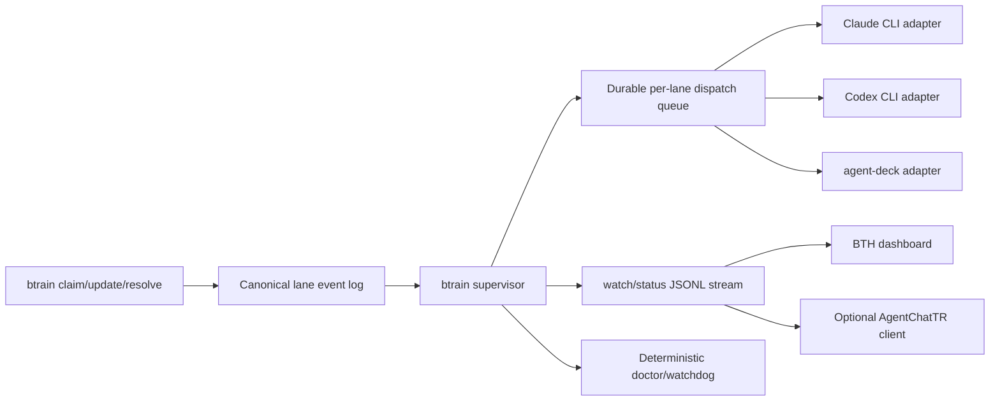

# BTH Supervisor and AgentChatTR Reassessment

**Date:** 2026-07-10
**Status:** Recommended implementation plan
**Constraint:** Model execution must use authenticated consumer/team CLI subscriptions, not metered model APIs.

## Decision

Keep `btrain` as the workflow authority. Replace its current one-lane polling loop with a durable, multi-lane supervisor that exposes an event stream any subscription-authenticated CLI agent can monitor.

Keep the BTH-customized AgentChatTR only as an optional human collaboration surface: dashboard, presence, chat, and manual agent nudges. Do not make AgentChatTR responsible for canonical handoff monitoring, workflow repair, or agent lifecycle.

For process/session supervision, run a time-boxed trial of [agent-deck](https://github.com/asheshgoplani/agent-deck). It already provides persistent conductors, status-driven notifications, worktrees, and sessions for locally authenticated Claude Code and Codex CLIs. BTH should integrate with it through a small adapter rather than reproduce its terminal supervision features.

## What the Audit Found

### BTH handoff loop

The current `btrain loop` is a useful proof of concept, but it is not yet a reliable supervisor:

- It calls `readCurrentState(repoRoot)` without a lane, so a multi-lane repo is effectively monitored through the configured default handoff path rather than scheduled lane-by-lane.
- It detects changes by serializing and polling the entire current state every two seconds.
- Its process lifetime is the loop lifetime. There is no persisted cursor, lease, resume point, or restart recovery.
- A configured runner executes one CLI process and then waits for any state mutation. There is no explicit delivery acknowledgement, accepted/start/completed lifecycle, or idempotency key.
- Missing `[agents.runners]` entries silently downgrade to a pending file plus desktop notification. On this checkout, that makes the loop manual even though `codex`, `claude`, and `gemini` appear in `[agents].active`.
- The default dispatch prompt is only `bth`. This is token-efficient, but the wrapper is ambiguous: `bth claim` is correct while the natural-looking `bth handoff claim` becomes a status check.
- `repair-needed` has no loop actor, so the supervisor stops instead of routing a deterministic repair or human escalation.
- A runner can mutate an unrelated lane and still satisfy the repo-level "state changed" test.

The state machine, locks, structured handoff packet, workflow event log, PR flow, and deterministic doctor/watchdog are still valuable. The weak point is runtime delivery, not workflow authority.

### Monitoring is duplicated

Three unrelated monitors currently observe overlapping state:

1. `btrain loop` polls handoff state and dispatches CLI runners.
2. `scripts/handoff-history-watcher.mjs` uses filesystem watching plus a launchd service to archive review-ready handoffs.
3. AgentChatTR launches a polling thread per repo, calls `btrain status --json`, posts transition messages, retries acknowledgements, and separately runs `btrain doctor --repair` every five minutes.

This produces avoidable race conditions, duplicated polling, multiple retry policies, and no single operational health view.

### AgentChatTR is useful but over-coupled

The BTH copy has real value that the upstream standalone checkout does not have:

- multi-repo lane dashboard
- repo-qualified routing
- agent presence and activity
- handoff notification deduplication and acknowledgement
- lane chat/archive behavior
- BTH context injection
- trace emission

However, it is a poor core harness today:

- Startup is spread across per-agent shell scripts, Python virtualenv bootstrapping, a FastAPI server, tmux sessions, and browser navigation.
- Agent wakeups use `tmux send-keys`, which is inherently less reliable than a process protocol or lifecycle hook.
- Readiness checks only establish that a binary and auth-looking files exist. They reported Codex ready even though `codex login status` failed because the current global config contains an obsolete `service_tier = "default"` value.
- The server and each agent wrapper have separate lifecycles and recovery behavior.
- The BTH-customized copy and the separate upstream checkout used during the audit have diverged substantially. That checkout also carried a stale local working-directory override. There is no safe single upgrade path while both copies remain runnable.
- The standalone upstream version still carries MCP-era files, while the BTH fork deliberately moved to REST-only integration. Treating both as runnable products is confusing.

## Target Architecture



### 1. Canonical event stream

Add a supported read API over the existing `.btrain/events/` records:

```text
btrain watch --repo . --actor codex --since <cursor> --format jsonl
btrain next --repo . --actor codex --format json
```

Every normalized event should include:

- stable event id and monotonically increasing per-lane sequence
- repo, lane, state hash, status, intended actor, and reason
- transition timestamp and source event path
- required action class (`write`, `review`, `repair`, `pr`, `human`)

Use filesystem notifications for low latency, but always reconcile against the event log after wake and on a periodic timer. Filesystem notifications are hints; the persisted cursor is the delivery guarantee.

### 2. Durable supervisor

Add one long-running command:

```text
btrain supervise start --repo .
btrain supervise status --repo .
btrain supervise logs --repo .
btrain supervise stop --repo .
```

Persist state under `.btrain/supervisor/`:

- event cursor per lane
- queued dispatch records
- attempt count and backoff deadline
- lease owner and lease expiry
- acknowledgement, started, completed, failed, or superseded status
- runner session/thread reference when available

Required behavior:

- schedule all active lanes independently
- deduplicate on `{lane, stateHash, intendedActor}`
- require an acknowledgement before considering a wakeup delivered
- supersede stale work when the lane state hash changes
- use bounded retry with jitter, then raise a human-visible failure
- recover queue state after restart
- never let the supervisor directly rewrite semantic lane state
- route `repair-needed` to deterministic doctor first, then the recorded repair owner, then a human
- provide configurable repo and per-agent concurrency limits

### 3. Subscription CLI adapters

Treat local authenticated CLIs as runners, never as model APIs:

- Claude: `claude -p --output-format stream-json --verbose --include-partial-messages ...`
- Codex: `codex exec --json -C <repo> ...`
- Agent-deck: create or nudge a session/conductor that already owns the authenticated CLI

Before dispatch, adapters must run real readiness commands, not file-presence heuristics:

- `claude auth status`
- `codex login status`
- a provider-specific version/config validation

Record whether authentication is subscription-managed. Refuse to fall back silently to an API key when subscription-only mode is enabled.

### 4. One-command local UX

Add a single entry point:

```text
btrain up --repo .
```

It should:

1. run readiness and config diagnostics
2. start or connect to the supervisor
3. start the dashboard service on one stable port
4. optionally start the AgentChatTR client when enabled
5. open one browser tab
6. print a compact health table and exact recovery commands

Install one user service (launchd on macOS, systemd user service on Linux), not one service per repo. The service should read the BTH registry and supervise registered repos dynamically.

### 5. Dashboard boundary

The browser dashboard should be served by the supervisor or a thin BTH web process and consume the canonical event stream. It should show:

- supervisor health and uptime
- each lane's current state, intended actor, and lease
- queued/running/acknowledged/failed delivery state
- CLI auth/config readiness
- last transition and last successful agent activity
- retry/cancel/nudge controls that call BTH, not AgentChatTR internals
- log links and an obvious "why is this stuck?" diagnosis

AgentChatTR can embed or link this view and add chat/presence. Removing AgentChatTR must not stop handoffs.

## AgentChatTR Keep/Change Decision

### Keep

- shared human/agent chat
- repo- and lane-scoped channels
- presence/activity display
- manual mentions and collaboration sessions
- lane archive and trace viewing

### Move to BTH supervisor

- status polling
- transition detection
- delivery retry/ack state
- `doctor --repair` scheduling
- canonical readiness
- service lifecycle and health

### Remove or deprecate

- duplicated standalone and vendored runnable copies
- per-agent server bootstrap scripts as the primary launch path
- direct reading of auth files as a readiness verdict
- `tmux send-keys` as the only delivery mechanism
- upstream MCP server/proxy code in the BTH deployment

The recommended packaging is one canonical AgentChatTR fork or adapter package with BTH-specific changes isolated behind a versioned integration boundary. Do not copy the whole directory into every initialized repo.

## Harness Options Under the Subscription-Only Constraint

### Recommended companion: agent-deck

[agent-deck](https://github.com/asheshgoplani/agent-deck) is the closest match to the missing runtime layer. It manages Claude, Codex, Gemini-family, and other local CLI sessions; supports worktrees; detects running/waiting/idle/error state; and provides persistent conductors with transition notifications and heartbeat monitoring. Its documented Docker mode shares host CLI authentication, so it can preserve subscription login rather than requiring model API keys.

Use it for session/process supervision and keep BTH for governance. Build a narrow proof of concept:

1. start one Claude writer and one Codex reviewer through agent-deck
2. have a conductor consume `btrain watch --format jsonl`
3. verify a complete claim -> review -> changes-requested -> resolve loop
4. measure missed wakes, restart recovery, time-to-ack, and human interventions

### Possible UI replacement trial: Claw-Kanban

[Claw-Kanban](https://github.com/GreenSheep01201/Claw-Kanban) is worth a separate UI spike because it provides a browser kanban, role-based assignment, real-time monitoring, a one-line installer, and an auto-start service while launching authenticated Claude Code and Codex CLI tools. It overlaps more heavily with BTH's task/state model, so do not adopt its workflow authority without a migration analysis.

### Full replacement candidate only: Gas Town

[Gas Town](https://github.com/steveyegge/gastown) has persistent work tracking, mailboxes, worktrees, monitoring, and multi-agent orchestration with Claude as the default runtime and Codex as an optional runtime. It could replace much of BTH, but adopting it would mean accepting Beads/Convoys/Mayor as a second or replacement workflow model. Evaluate only if the goal changes from improving BTH to replacing it.

### Useful but too shallow: Claude Squad

[Claude Squad](https://github.com/smtg-ai/claude-squad) cleanly manages multiple Claude Code, Codex, and Gemini terminal agents in tmux/worktrees. It is a good manual session switcher, but it does not supply the durable event/ack/retry supervisor BTH needs.

### Do not choose: Vibe Kanban

The [Vibe Kanban repository](https://github.com/BloopAI/vibe-kanban) now says the product is sunsetting. It should not become a new dependency.

### Built-in Codex and Claude capabilities

Codex is included in ChatGPT Plus, Pro, Business, and Enterprise/Edu plans and supports ChatGPT-managed CLI authentication ([OpenAI plan guidance](https://help.openai.com/en/articles/11369540-using-codex-with-your-chatgpt-plan), [Codex CLI README](https://github.com/openai/codex/blob/main/README.md)). Claude Code supports Claude subscription authentication, including Pro/Max and organizational plans ([Anthropic setup guidance](https://docs.anthropic.com/en/docs/claude-code/getting-started)). These should remain the primary execution engines.

Do not plan around consumer Gemini CLI subscription access. Google ended Login-with-Google access for consumer Gemini Code Assist, Google AI Pro, and Google AI Ultra on June 18, 2026 and directs those users to Antigravity; Standard/Enterprise Gemini Code Assist subscriptions remain supported ([Google deprecation notice](https://developers.google.com/gemini-code-assist/docs/deprecations/code-assist-individuals)).

## Immediate Fixes Before Building the Supervisor

1. Repair Codex CLI configuration by removing or changing the obsolete `service_tier = "default"`; verify with `codex login status`.
2. Add explicit runner mappings for active agents, and make `btrain doctor` warn when an active agent has no runner.
3. Make AgentChatTR readiness execute the real provider readiness command and surface stderr.
4. Make `bth handoff ...` either work as an alias or fail with a corrective message; never silently show status.
5. Remove invalid/stale repo entries from AgentChatTR config and expose per-repo poll failures in the UI.
6. Choose one canonical AgentChatTR installation and archive the other after preserving BTH-only changes.
7. Add a `btrain loop --lane <id>` requirement until multi-lane supervision exists; do not imply the current loop schedules all lanes.

## Phased Delivery

### Phase 0: Stabilize current startup (1-2 small lanes)

- readiness false-positive fixes
- runner/config doctor warnings
- `bth` alias correction
- one `btrain up --check` command that performs non-mutating diagnostics

### Phase 1: Event/watch contract

- normalized event cursor and JSONL watch command
- lane-scoped `next` query
- tests for missed filesystem notifications and cursor replay

### Phase 2: Durable supervisor

- queue, lease, ack, retry, recovery, and multi-lane scheduling
- Claude/Codex subscription CLI adapters
- integration tests using fake runners plus opt-in real CLI smoke tests

### Phase 3: Dashboard and service

- supervisor health API and browser UI
- single launchd/systemd user service
- `btrain up/down/status/logs`

### Phase 4: AgentChatTR adapter and agent-deck trial

- remove duplicate polling from AgentChatTR
- consume supervisor events and health
- evaluate agent-deck conductor against the same trace/eval scenarios

## Acceptance Metrics

- zero missed handoff transitions across supervisor restarts in replay tests
- every dispatch has a durable id, acknowledgement, and terminal outcome
- no duplicate agent wake for the same lane state hash
- independent progress on two simultaneous lanes
- clear UI diagnosis within one screen for auth failure, unavailable runner, timeout, stale lease, and repair-needed state
- one command to launch the usable dashboard
- no model API key required for Claude or Codex execution
- AgentChatTR can be stopped without interrupting BTH handoff supervision

## Final Recommendation

Build the BTH supervisor and keep AgentChatTR optional. Trial agent-deck as the session/conductor layer before writing another terminal manager. Do not replace BTH with a chat system, and do not let a dashboard become a second source of workflow truth.
