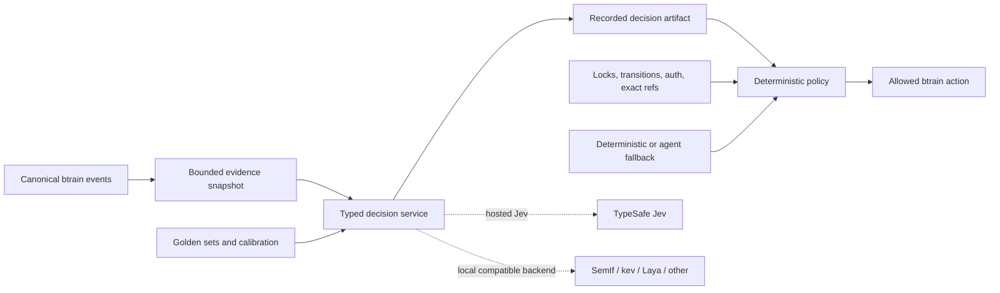

# Jev and TypeSafe Repository Assessment

**Date:** 2026-09-19  
**Status:** Research and proposed architecture. No production integration has been implemented.  
**Primary scope:** btrain. Secondary scope: the ai_sales and mech_ai knowledge-base systems.  
**Source video:** [GitHub Trending Today #50](https://www.youtube.com/watch?v=hKfHfdVhqT8&t=41s)

## Decision

btrain can use Jev to make a large improvement, but the right design is not a
Jev-controlled workflow engine. The right design is a deterministic workflow authority
with a typed semantic decision plane.

The authority plane must continue to own:

- lane transitions
- actor authorization
- file locks
- exact-head and exact-commit checks
- retry and timeout bounds
- override records
- security gates
- artifact persistence
- final state changes

The decision plane can improve:

- context selection and compaction
- task and artifact classification
- reviewer and skill routing
- handoff-quality checks
- PR comment interpretation
- progress, stuck, and drift detection
- semantic rule enforcement
- review-risk scoring
- evidence sufficiency and citation checks
- search, ranking, and memory invalidation

This split matches TypeSafe's own design guidance: code controls the workflow and the
model makes narrow typed decisions. It also matches the strongest repositories from the
video. `foreman`, `abide`, `fast-jev-compaction`, `perch`, and both `jev-review`
implementations all keep orchestration and policy in code.

The first implementation should be a provider-neutral shadow decision service. It should
record results in btrain trace bundles but must not change lane state. After the shadow
eval passes, btrain can use the service for advisory context selection, handoff linting,
PR-review interpretation, and supervisor signals. Hard workflow transitions must remain
deterministic.

## What changed after reviewing the video repositories

The earlier ai_sales research correctly identified product scoring, retrieval ranking,
abstention, passage classification, citation checks, and metadata classification as
candidate uses. The repositories in this video add five important patterns:

1. **Compile local rules into a model rubric.** `abide` converts repository instruction
   files into scoped, auditable questions. It sends only rules that need semantic
   judgment to the model.
2. **Judge the whole turn, not every edit.** `abide` reports 73% precision for turn-level
   findings and 26% for edit-level findings in its published replay. That result argues
   for coherent btrain checkpoints instead of constant model interruption.
3. **Use a separate observer loop.** `foreman` watches a coding worker through bounded
   evidence and lets deterministic policy choose continue, verify, steer, stop, retry,
   finish, or escalate.
4. **Keep original evidence when compacting.** `fast-jev-compaction` keeps selected
   transcript content verbatim. It drops or truncates low-value tool records and falls
   back to native compaction on any failure.
5. **Make the model backend replaceable.** `tax-doc-classifier`, `SemIf`, `kev`,
   `simple-jev`, `localjev`, and `openjev-sglang` expose narrow interfaces that permit
   comparison between hosted Jev and local models.

These patterns fit btrain's existing harness, trace, and supervisor direction better than
a direct SDK call scattered through `core.mjs`.

## Evidence boundaries

- The video names 35 GitHub repositories. A source scan found 21 with Jev, TypeSafe,
  System One, or a compatible decision-model implementation.
- Repository metadata and source were inspected from the default branches on 2026-09-19.
  The evidence manifest below pins the 35 repository heads that were rechecked on 2026-09-22.
  Follow each commit link to validate the classification and source-level observations without
  relying on a mutable default branch. Recheck newer revisions before adoption.
- Stars measure attention, not quality.
- Vendor claims are not independent evidence.
- Project-published benchmarks are useful leads. They do not replace btrain's own evals.
- An organizational account describes a 2026-09-18 staff_search role
  experiment. One Jev Choice mapped 23 of 23 in-taxonomy paraphrases correctly, but it
  also answered all 6 out-of-taxonomy controls confidently and incorrectly. A separate
  coverage Noul rejected all 6 controls and retained all 23 valid cases.
  This report does not contain a direct artifact for those counts. Treat them as an
  unverified historical account, not an adoption gate or independently measured result.
  The companion btrain experiment at commit
  [`613851a`](https://github.com/codeslp/btrain/tree/613851af91e7029f70c8ff692c92382b12ef70ea/experiments/jev-btrain)
  provides frozen pilot artifacts. Its
  [results report](https://github.com/codeslp/btrain/blob/613851af91e7029f70c8ff692c92382b12ef70ea/research/jev-btrain-experiment-results.md)
  states the limits of that evidence. The companion commit is separate from this report commit.
- TypeSafe Choice and Score confidence is derived from the answer distribution. It
  measures concentration, not correctness. A wrong answer can have high confidence.
- Any private code, transcript, corpus, or customer content sent to a hosted provider
  needs an explicit data-policy decision.

## The architecture opportunity in btrain

### Current shape

btrain already has the pieces needed for a typed decision layer:

- deterministic lane transitions in `src/brain_train/transitions.mjs`
- file locks and audited overrides in `src/brain_train/core.mjs`
- task and artifact envelopes in `src/brain_train/harness/task-envelope.mjs`
- local trace and benchmark schemas in `src/brain_train/harness/`
- a context budget in `src/brain_train/context_budget.mjs`
- deterministic code rules in `src/brain_train/review/code-rules.mjs`
- regex-based PR bot classification in `src/brain_train/pr-flow.mjs`
- compact organizational context receipts in `src/brain_train/unblocked/context.mjs`
- a proposed durable supervisor and canonical event stream in
  `research/bth-supervisor-agentchattr-reassessment.md`

The main weakness is that semantic judgments are split between brittle heuristics and
expensive generative-agent calls. Jev can fill that middle layer.

### Target shape



The decision service should accept one stable contract:

```json
{
  "decision": "handoff-readiness",
  "schemaVersion": 1,
  "state": {},
  "questions": {},
  "model": "pinned-provider-model",
  "budget": {
    "maxStateTokens": 16000,
    "timeoutMs": 3000,
    "maxCalls": 1
  }
}
```

The result artifact should record:

- provider and pinned model
- request schema version
- state hash
- question-set hash
- complete probability distributions
- selected answers
- latency and usage
- fallback reason
- policy action
- human or downstream outcome when known

This is a natural extension of the task envelope and trace bundle. It should not become a
second lane-state store.

## btrain opportunity map

### P0: provider-neutral decision adapter and eval harness

**Problem:** Direct calls from unrelated btrain modules would couple workflow logic to one
vendor and make calibration difficult.

**Design:** Add a small adapter behind one interface. Support a fake backend first, hosted
Jev second, and local compatible backends later. Store question sets as versioned harness
assets. Store every shadow result in trace bundles.

**Borrow from:** `tax-doc-classifier`'s one-method backend, `kev`'s wire-compatible API,
and the existing btrain harness registry.

**Gate:** No model-controlled behavior until at least one frozen, labeled benchmark passes.

### P1: semantic handoff linter

**Current behavior:** `collectNeedsReviewContextIssues` checks that six fields exist and do
not contain known placeholders. It cannot tell whether the content is relevant, specific,
or supported by the diff and verification artifacts.

**Questions over the task, packet, diff summary, and verification output:**

- Does the packet describe the actual changed surface?
- Does each verification claim have evidence in the supplied output?
- Does the remaining-gap section disclose known failures and skips?
- Are the review asks specific enough for another agent to act on?
- Does the claimed objective appear complete?
- Is there an unresolved contradiction between the packet and repository state?

**Policy:** Start as advisory. The model can request packet repair, but it cannot approve a
handoff. Existing hard checks remain mandatory. A generative reviewer remains responsible
for code-level correctness.

**Borrow from:** `abide` for compiled rules and banded verdicts. Use high, middle, and low
bands instead of a 0.5 threshold.

### P1: PR review-signal interpreter

**Current behavior:** `pr-flow.mjs` uses regular expressions such as `looks good`,
`approved`, `changes requested`, and `blocking` to classify bot comments.

**Design:** Keep exact-head matching, bot identity, timestamps, reaction handling, and
formal GitHub review states deterministic. Use one typed semantic call only when the
structured fields and exact phrases do not settle the result.

**Questions:**

- Does the latest current-head comment communicate actionable feedback?
- Does it communicate a clear review with no remaining findings?
- Does it require human interpretation?
- Which reason class applies: correctness, security, test gap, scope, or style?

**Policy:** The semantic result may classify `feedback`, `clear`, or `uncertain` only after
commit and identity checks pass. `uncertain` stays in `pr-review`. A model answer never
marks a stale-head review current.
Semantic `clear` remains advisory and cannot satisfy approval or merge gates. Assist
mode may add validated blocking feedback; deterministic review evidence is still required
to advance a PR.

### P1: context curator before dispatch

**Current behavior:** btrain enforces token ceilings after sessions become large. The
September token study shows that cached context is a major cost source.

**Design:** Before each dispatch, score candidate context artifacts for current usefulness.
Keep the selected content verbatim. Drop or summarize only low-value tool records and
stale operational chatter. Always pin task, constraints, locks, current state, recent
errors, user messages, and unresolved findings.

**Questions per candidate artifact:**

- Is this needed to complete the current action?
- Must the full content remain, or is a reference enough?
- Is this superseded by newer evidence?
- Does it contain an unresolved decision or failure?
- Would omission create a safety or authorization risk?

**Policy:** Use a minimum reduction target. Fall back to the existing deterministic packet
when the provider fails or the reduction is too small. Never rewrite selected evidence.

**Borrow from:** `fast-jev-compaction`. Adapt it to btrain dispatch packets and trace
artifacts rather than Claude-only transcript hooks.

### P1: supervisor observation loop

**Current direction:** btrain already plans a durable supervisor with per-lane cursors,
acknowledgement, leases, retry, and restart recovery.

**Design:** Add a separate semantic observer to the supervisor. It reads a bounded snapshot
of the task, current lane state, recent events, working-tree summary, test results, and
runner output. It emits signals only.

**Suggested signals:**

- `meaningful_progress`
- `worker_stuck`
- `work_off_track`
- `requirements_satisfied`
- `implementation_complete`
- `tests_sufficient`
- `needs_independent_verification`
- `needs_human`
- `instruction_drift`
- `context_reseed_needed`

**Policy:** Deterministic code maps signals to the limited actions already allowed by the
supervisor. A model cannot mutate lane state, release locks, push code, approve review, or
consume an override.

**Borrow from:** `foreman`. Reuse the bounded observation and separate-policy pattern, not
its Codex-specific runtime.

### P1: repository-rule compiler and semantic checks

**Current behavior:** `review/code-rules.mjs` contains useful deterministic regex checks,
but it cannot enforce rules such as “preserve unrelated changes,” “do not broaden scope,”
or “use the server as the trust boundary.”

**Design:** Compile rules from `AGENTS.md`, skill instructions, specs, and optional project
policy into a committed rubric. Classify each rule as:

- deterministic lint
- semantic diff check
- semantic turn check
- deferred because it needs full-repository evidence
- excluded because it is background, not a rule

Use deterministic checks first. Batch applicable semantic questions over a focused diff or
turn. Every finding must name the source rule and scope.

**Borrow from:** `abide` for instruction compilation and calibration. Borrow `perch` only
for focused code-unit scanning. Do not run a whole-repository semantic scan on every turn.

### P2: risk and verification planner

**Design:** Ask atomic questions about a claimed change, then let code build the
verification plan.

Candidate questions:

- Does the change cross an authentication or authorization boundary?
- Does it affect persistence, migration, payment, or irreversible actions?
- Does it span multiple components or event consumers?
- Does it change a public contract?
- Does it touch modeled or pinned formal-spec behavior?
- Is a browser, integration, formal, security, or deployment check applicable?

The output should select from a closed catalog of existing skills and commands. A separate
coverage Noul must ask whether the catalog contains an applicable action. This may reduce
forced-choice errors, but it can also be wrong. Evaluate it on frozen negative controls
and retain deterministic abstention and action boundaries.

**Policy:** The model may add checks. It should not remove mandatory checks inferred from
paths, config, or deterministic rules.

### P2: task, lane, reviewer, and skill routing

**Design:** Use task state plus capability cards to rank suitable idle lanes, reviewers,
skills, or runners. Ask coverage separately from selection. Respect hard exclusions for
same-author review, unavailable runtimes, active locks, trust boundaries, and unsupported
models before semantic ranking.

**Borrow from:** TypeSafe's skill-suggestion pattern and the dynamic option-set design in
`jev-ultrafast`.

### P2: review-risk triage

**Design:** Use an atomic risk matrix first. Run deeper staged review only for dimensions
that cross a calibrated threshold. Route findings to a generative reviewer for diagnosis
and remediation.

**Borrow from:** `devagrawal09/jev-review` for staged evidence selection and
`NiazMorshed2007/jev-review` for dimension-by-dimension change tracking.

**Caution:** The MCP review project does not provide explanations. Low scalar scores alone
must not become blocking findings.

### P2: workflow memory leases and invalidation

**Design:** Treat each durable summary, recommendation, capability claim, or recovery note
as a versioned memory with provenance and a lease. When new events arrive, ask whether the
new evidence invalidates the old memory. Code expires or retains the item based on policy.

This is more useful than embedding every historical handoff and retrieving nearest text.
It attacks stale truth directly.

**Needed before implementation:** A frozen contradiction and supersession dataset from
real btrain history.

### P3: semantic code search and natural-language database predicates

`perch` and `pg-jev` demonstrate semantic predicates over methods and rows. btrain could
use this for offline analysis of trace bundles and event histories. It should not place a
network model call inside the hot path of ordinary state reads.

The useful shape is a command such as:

```text
btrain history ask --where "the reviewer found a test gap caused by cross-component wiring"
```

The implementation should shortlist with local structured filters or lexical/vector search,
then use typed semantic ranking. `pg-jev` itself is not a direct fit because btrain is
file-backed and managed Postgres platforms often cannot load its required extension.

## What must not become probabilistic

| Surface | Why it stays deterministic |
| --- | --- |
| Actor authorization | Probability is not identity. |
| File-lock overlap | Paths and ownership are exact facts. |
| Lane transition legality | The state machine is the workflow contract. |
| Exact-head review freshness | Commit identity is exact. |
| Override consumption | Overrides are explicit human authority. |
| Secret detection patterns | Known secret shapes must block without model availability. |
| Required fields and schema validation | Syntax and types are mechanical. |
| Token counting and hard ceilings | Models cannot count reliably. |
| Dates, timeout deadlines, and retry limits | Arithmetic and clocks belong in code. |
| Test, build, and formal-check results | Exit codes and artifacts are evidence. |
| Tenant and corpus authorization | A model can rank eligible items but cannot admit them. |
| Merge, push, deploy, and destructive actions | These require explicit policy and authority. |

## Proposed refactor sequence

### Phase 0: freeze evidence and interfaces

1. Define a provider-neutral decision request and result schema.
2. Add a fake backend for tests.
3. Add decision artifacts to harness trace bundles.
4. Pin model identifiers and question-set versions.
5. Add budgets for calls, tokens, time, and retries.
6. Create golden sets from real btrain history.
7. Add explicit privacy classes for request state.

This phase changes no workflow behavior.

### Phase 1: advisory decisions

Implement these in shadow or advisory mode:

1. PR comment classification after deterministic freshness checks.
2. Handoff packet relevance and evidence checks.
3. Context-item keep/full/reference decisions.
4. Risk and verification applicability.
5. Semantic rule checks at the end of a turn.

Compare each result with the eventual reviewer or operator outcome.

### Phase 2: bounded automation

Allow the decision plane to:

- request more handoff detail
- add verification steps
- choose a skill from an eligible catalog
- select a fallback reviewer or runner from an eligible set
- omit low-value context artifacts
- route uncertain PR comments to human review

Do not allow it to approve, merge, unlock, push, deploy, or bypass.

### Phase 3: semantic supervisor

Add the observer loop to the durable supervisor. Start with progress, stuck, off-track,
verification-needed, and human-needed signals. Require persisted evidence and hysteresis
before any intervention. Cap steering and retry attempts.

### Phase 4: provider comparison and optional local inference

Run the same frozen btrain benchmark against:

- pinned TypeSafe Jev
- one small local backend such as Laya for low-cardinality classification
- `kev-4b` or another stronger local compatible model
- the existing generative-agent path
- deterministic baselines

Select a backend per decision family. Do not assume one model wins every task.

## Evaluation plan

### Datasets

Build versioned cases from actual history:

- clear versus feedback PR comments
- complete versus weak handoff packets
- correct versus incorrect reviewer context
- useful versus stale context artifacts
- productive versus stuck runner windows
- rule-compliant versus violating diffs
- in-catalog versus out-of-catalog routing cases
- current versus superseded memories

Freeze test cases before tuning question text.

### Metrics

Measure per decision family:

- precision, recall, and confusion matrix
- Brier score and expected calibration error where labels permit
- false autonomous-action rate
- abstention quality
- stability across repeated runs and model pins
- latency and cost
- token reduction
- downstream task success
- reviewer time saved
- provider-failure fallback success

### Required controls

- deterministic baseline
- current regex or heuristic baseline
- generative-agent baseline where one exists
- negative controls with no valid option
- adversarial and irrelevant state
- option-order perturbations
- rephrased but equivalent questions
- stale and contradictory evidence
- provider timeout and malformed-response cases

### Initial release gates

Before a decision family can affect behavior:

- no hard gate can be bypassed
- fallback must work on every injected provider failure
- no out-of-catalog case may be forced into an autonomous action
- semantic findings must trace to supplied evidence
- model and question-set versions must appear in the trace
- the shadow result must beat the existing baseline on a frozen test set
- a human must approve the threshold and allowed action set

## Repository inventory from the video

### Immutable evidence manifest

The classification below was rechecked against these exact commits on 2026-09-22. The
`Relevant` value records inclusion in the Jev-specific analysis; it is not a quality score.

| Repository | Reviewed commit | Relevant |
| --- | --- | --- |
| `coldteadotai/abide` | [`f268382`](https://github.com/coldteadotai/abide/tree/f2683828965ced03da07abae811e78af0383040c) | yes |
| `thruwire/foreman` | [`a7d21d1`](https://github.com/thruwire/foreman/tree/a7d21d18d306a0cb9f3e15acefbdb5663521405c) | yes |
| `tamaratran/fast-jev-compaction` | [`e3f262a`](https://github.com/tamaratran/fast-jev-compaction/tree/e3f262a7f4d42bd8dd32ced30d26176f7cb545b0) | yes |
| `devagrawal09/jev-review` | [`31f8960`](https://github.com/devagrawal09/jev-review/tree/31f89602797fb7bea007f8a480bf368bf564954e) | yes |
| `NiazMorshed2007/jev-review` | [`57690af`](https://github.com/NiazMorshed2007/jev-review/tree/57690af54ef7d862c2483342c1e61c14dffcf727) | yes |
| `lakeday-org/perch` | [`6a399b7`](https://github.com/lakeday-org/perch/tree/6a399b735b7aca43a6db9bffa679d8adbf7b28b4) | yes |
| `superagents-lab/jev-search` | [`67027d0`](https://github.com/superagents-lab/jev-search/tree/67027d0185a9b22eb2a178f0eb15250d12ddabe6) | yes |
| `kyotofin/tax-doc-classifier` | [`3e95a77`](https://github.com/kyotofin/tax-doc-classifier/tree/3e95a77f763c6becb78472f8b2ce2f54237f9214) | yes |
| `realZachi/pg-jev` | [`afd11fa`](https://github.com/realZachi/pg-jev/tree/afd11fa856d7a2b831a1bfd8ee7f869ce8efcd62) | yes |
| `TheoLeeCJ/SemIf` | [`1f2dea3`](https://github.com/TheoLeeCJ/SemIf/tree/1f2dea3e25379f9dfc98cb83c324f00ab5deda37) | yes |
| `jaredpalmer/kev` | [`90990a5`](https://github.com/jaredpalmer/kev/tree/90990a5fac2995b9faa3190f7d437e84f2067768) | yes |
| `NandhaKishorM/laya` | [`573e5b6`](https://github.com/NandhaKishorM/laya/tree/573e5b62696ba441230cd6be71d593331b5d23af) | yes |
| `featherless-ai/simple-jev` | [`b02aa81`](https://github.com/featherless-ai/simple-jev/tree/b02aa81c915a8193759b3cd33fef74721d6e005b) | yes |
| `ekzhang/openjev-sglang` | [`f3e1678`](https://github.com/ekzhang/openjev-sglang/tree/f3e1678168b2e9a298bb47639444b428b661c4b2) | yes |
| `githubnext/localjev` | [`3f23e36`](https://github.com/githubnext/localjev/tree/3f23e36e1a3bff46c7e83e8e3781d3512bc82021) | yes |
| `TianyuCodings/NanoJev` | [`76fdfc9`](https://github.com/TianyuCodings/NanoJev/tree/76fdfc9ecdca45a9bcef17991a07d3041a87685a) | yes |
| `browser-use/jev-ultrafast` | [`1231850`](https://github.com/browser-use/jev-ultrafast/tree/1231850a0bf1a0c0341fe408ef1668dbbfdfac46) | yes |
| `awlevin/typesafe-computer-use` | [`cc7b506`](https://github.com/awlevin/typesafe-computer-use/tree/cc7b5066ae1a07b5e3182e8f87a9b5b6dfdcffc1) | yes |
| `droidrun/mobile-jev` | [`395fc22`](https://github.com/droidrun/mobile-jev/tree/395fc222beac4f059f9a0beb337d114a2b066e99) | yes |
| `fhshaik/typesafe-mario` | [`ca22449`](https://github.com/fhshaik/typesafe-mario/tree/ca22449ed187118d19326d1f54b01b6636578aa4) | yes |
| `jarrodwatts/jev-trader` | [`b587759`](https://github.com/jarrodwatts/jev-trader/tree/b587759e459ea049590102e54a0b07800864cdc3) | yes |
| `MaxGramser/homeassistant_espscreen` | [`8a06c16`](https://github.com/MaxGramser/homeassistant_espscreen/tree/8a06c16b4a2ae04b63a852934ecd067014fb0e6c) | no |
| `amap-cvlab/ABot-Recon` | [`7a10be1`](https://github.com/amap-cvlab/ABot-Recon/tree/7a10be152d0478265270f46c637f9de963e7a60e) | no |
| `anthropics/uplifting-biomolecular-modeling` | [`f4f62fa`](https://github.com/anthropics/uplifting-biomolecular-modeling/tree/f4f62fa6592ae4938d49b1757bea0cfeff9f468e) | no |
| `robbietilton/Compositor` | [`609dbeae`](https://github.com/robbietilton/Compositor/tree/609dbeae2ef68ef4fc82d67e4981a49852eb6e13) | no |
| `davidmokos/expo-gpt-live` | [`9e83073`](https://github.com/davidmokos/expo-gpt-live/tree/9e83073ef5b3a986124d9141271c09443cbe8d5b) | no |
| `dealerdefi/FLYON` | [`4ee0d71`](https://github.com/dealerdefi/FLYON/tree/4ee0d71e09a6c7ca4c9a6e565383899d2e026877) | no |
| `dmtrKovalenko/bashka` | [`09dceab`](https://github.com/dmtrKovalenko/bashka/tree/09dceab4a34c78364ab67f070a1bcce1673b2a73) | no |
| `eliasstravik/herdr-projects` | [`a4cdb0a`](https://github.com/eliasstravik/herdr-projects/tree/a4cdb0a69713d982d96f9062548cf885f013c442) | no |
| `incoai/splash` | [`edb4b8f`](https://github.com/incoai/splash/tree/edb4b8fa4eee5fef624809cd7f30f0651c58a167) | no |
| `kuhnhomeuk-cell/procedural-film` | [`ec29e23`](https://github.com/kuhnhomeuk-cell/procedural-film/tree/ec29e23474860e83ab5b4d0131bd6e6b92e12a48) | no |
| `lidge-jun/aside-codemode` | [`0936c1c`](https://github.com/lidge-jun/aside-codemode/tree/0936c1c2f3b4a6bb77524529fb562f7baf9e9a5a) | no |
| `mirkovicdev/HFTENGINE` | [`8d7e290`](https://github.com/mirkovicdev/HFTENGINE/tree/8d7e2904d86d40265b05a366d57e296ee0cd5d98) | no |
| `penberg/titania` | [`d820923`](https://github.com/penberg/titania/tree/d82092341c0b856e6ea2f2b998133801965bc95b) | no |
| `planetscale/lead` | [`bd95c7e`](https://github.com/planetscale/lead/tree/bd95c7e51b6afce81396790852ee2f2c169570ad) | no |

### Highest-value repositories for btrain

| Repository | What it demonstrates | Recommended use |
| --- | --- | --- |
| [coldteadotai/abide](https://github.com/coldteadotai/abide) | Compiles repository instructions into a scoped rubric. Separates lintable, semantic, and deferred rules. Uses banded verdicts and publishes a replay benchmark. | Best source for a btrain semantic-policy compiler and end-of-turn rule checks. |
| [thruwire/foreman](https://github.com/thruwire/foreman) | Runs an independent observer over bounded worker evidence. Deterministic policy maps ten semantic signals to a small action set. | Best source for a btrain supervisor observer loop. Reuse the pattern, not the runtime. |
| [tamaratran/fast-jev-compaction](https://github.com/tamaratran/fast-jev-compaction) | Scores tool calls and results, preserves selected messages verbatim, applies token budgets, and falls back safely. | Best source for pre-dispatch context curation and later transcript compaction. |
| [devagrawal09/jev-review](https://github.com/devagrawal09/jev-review) | Staged review: risk matrix, file profile, evidence selection, mechanism, severity, reviewer routing. | Use its staged question design for risk triage and evidence selection. |
| [NiazMorshed2007/jev-review](https://github.com/NiazMorshed2007/jev-review) | MCP-based repeated scoring across independent quality dimensions with previous-result deltas. | Useful as an optional advisory reviewer. Do not block on unexplained scalar scores. |
| [lakeday-org/perch](https://github.com/lakeday-org/perch) | Semantic rules over code units with callers and callees, scoped YAML rules, CI modes, and focused rechecks. | Use for offline or targeted semantic scans. Evaluate against btrain's existing deterministic review rules. |

### Highest-value repositories for knowledge-base work

| Repository | What it demonstrates | Recommended use |
| --- | --- | --- |
| [superagents-lab/jev-search](https://github.com/superagents-lab/jev-search) | Separates query understanding, source choice, concurrent search, result ranking, provider fallback, and streaming. It returns links, not generated answers. | Pattern for search orchestration and provider fallback. Useful for research tools, not a replacement for current KB retrieval. |
| [kyotofin/tax-doc-classifier](https://github.com/kyotofin/tax-doc-classifier) | Hierarchical document classification with a generated criteria catalog, strict evaluation, runner-up probabilities, and a replaceable backend. | Strong pattern for ingestion metadata, document family, and page-type classification. |
| [realZachi/pg-jev](https://github.com/realZachi/pg-jev) | Semantic predicates over Postgres rows, batched requests, read-ahead, caching, and measured batch-size degradation. | Useful design reference for offline semantic analysis. The extension itself is not a fit for btrain's file-backed core or managed Postgres deployments. |
| [TheoLeeCJ/SemIf](https://github.com/TheoLeeCJ/SemIf) | Open-model typed decisions, shared-prefix reuse, browser and local backends, committed raw results, and known failures. | Candidate local evaluation backend and a strong reproducibility reference. |
| [jaredpalmer/kev](https://github.com/jaredpalmer/kev) | Jev-compatible local server with exact question isolation, multiple model sizes, frozen suites, and out-of-domain measurements. | Stronger local backend candidate where hardware permits. |
| [NandhaKishorM/laya](https://github.com/NandhaKishorM/laya) | Apache-licensed local typed-decision models with language routing, calibration results, and explicit high-cardinality limits. | Candidate for low-cardinality and multilingual classification. Do not use its own confidence to detect wrong-language routing. |
| [featherless-ai/simple-jev](https://github.com/featherless-ai/simple-jev) | Reference Transformers server with shared-prefix execution and no output-token generation. | Useful implementation reference for a self-hosted adapter. It does not publish task-quality evidence. |
| [ekzhang/openjev-sglang](https://github.com/ekzhang/openjev-sglang) | High-throughput Jev-compatible API on SGLang with cache, concurrency, limits, health endpoints, and explicit non-calibration warning. | Infrastructure reference for large-scale self-hosting. Too heavy for the first btrain pilot. |
| [githubnext/localjev](https://github.com/githubnext/localjev) | Jev-compatible bridge over local DiffusionGemma, with retries and a repeatable model bake-off. | Useful for provider comparison. Generated probabilities are not equivalent to direct logit readout. |
| [TianyuCodings/NanoJev](https://github.com/TianyuCodings/NanoJev) | Small-model training pipeline, parallel dynamic candidates, games, probability losses, and replayable traces. | Research reference only unless btrain decides to train a domain model. |

### Application demonstrations

| Repository | What it demonstrates | Relevance here |
| --- | --- | --- |
| [browser-use/jev-ultrafast](https://github.com/browser-use/jev-ultrafast) | Dynamic action and target options, speculative target questions, stale-target validation, and independent outcome checks. | The dynamic eligible-option pattern maps well to reviewer, skill, and runner routing. |
| [awlevin/typesafe-computer-use](https://github.com/awlevin/typesafe-computer-use) | Deterministic state extraction plus typed action selection. It documents the engineering needed when a frontier model no longer reasons over raw input. | Strong warning: moving judgment to Jev transfers preprocessing and invariants into code. |
| [droidrun/mobile-jev](https://github.com/droidrun/mobile-jev) | Typed mobile actions, exact text spans, no blind mutation retry, and task-specific completion verification. | Good reference for idempotency and independent verification. |
| [fhshaik/typesafe-mario](https://github.com/fhshaik/typesafe-mario) | Converts raw emulator state into compact semantic telemetry before action selection. | Reinforces the need for a curated btrain observation schema. |
| [jarrodwatts/jev-trader](https://github.com/jarrodwatts/jev-trader) | Time-budgeted typed decisions in a fast event loop with dry-run mode and complete event records. | Useful shadow-mode and latency-budget pattern. Do not infer financial accuracy from the demo. |

### Repositories excluded from the Jev-specific analysis

A source scan found no Jev, TypeSafe, or System One integration in these 14 repositories
from the same video:

- [MaxGramser/homeassistant_espscreen](https://github.com/MaxGramser/homeassistant_espscreen)
- [amap-cvlab/ABot-Recon](https://github.com/amap-cvlab/ABot-Recon)
- [anthropics/uplifting-biomolecular-modeling](https://github.com/anthropics/uplifting-biomolecular-modeling)
- [robbietilton/Compositor](https://github.com/robbietilton/Compositor)
- [davidmokos/expo-gpt-live](https://github.com/davidmokos/expo-gpt-live)
- [dealerdefi/FLYON](https://github.com/dealerdefi/FLYON)
- [dmtrKovalenko/bashka](https://github.com/dmtrKovalenko/bashka)
- [eliasstravik/herdr-projects](https://github.com/eliasstravik/herdr-projects)
- [incoai/splash](https://github.com/incoai/splash)
- [kuhnhomeuk-cell/procedural-film](https://github.com/kuhnhomeuk-cell/procedural-film)
- [lidge-jun/aside-codemode](https://github.com/lidge-jun/aside-codemode)
- [mirkovicdev/HFTENGINE](https://github.com/mirkovicdev/HFTENGINE)
- [penberg/titania](https://github.com/penberg/titania)
- [planetscale/lead](https://github.com/planetscale/lead)

Some of these may still contain useful unrelated ideas. They are outside this Jev-specific
assessment.

## ai_sales recommendations

The existing ai_sales Jev application survey and scoring pre-registration are strong. Do
not replace them. Add the following evidence from this review:

1. Use `tax-doc-classifier`'s backend abstraction for the planned scoring experiment.
2. Add a separate coverage Noul to every closed-choice routing or taxonomy task.
3. Evaluate `abide`-style rule compilation for coaching and scoring policies only after
   product rubrics are versioned and human-readable.
4. Use `jev-search`'s separation of source choice, concurrent retrieval, and result ranking
   as an orchestration pattern.
5. Keep the planned rep-performance experiment first. It has a stronger ground-truth and
   baseline story than immediate retrieval replacement.
6. For the second experiment, compare Jev reranking with the existing pgvector hybrid path
   and a purpose-built reranker. Do not grade Jev with Jev.

## mech_ai recommendations

mech_ai already has a measured hybrid FTS, vector, graph, rerank, and diversity pipeline.
Its retrieval research shows that candidate-pool width, metadata, gold-label quality, and
chunking can dominate model choice. Jev should not replace that stack.

The best pilots are:

1. **Evidence sufficiency:** Does the retrieved set answer the technician's question?
2. **Citation entailment:** Does each cited passage support, contradict, or say nothing
   about each material claim?
3. **Passage safety and contradiction:** Is a retrieved passage relevant, evidentiary,
   contradictory, or instruction-like?
4. **Ingest metadata:** Choose document family, equipment applicability, page type, and
   content type from closed catalogs.
5. **Query class:** Decide whether symptom-only expansion is applicable. Keep identifier
   parsing and equipment filters deterministic.

Every pilot must run on the existing golden set. Report content recall, document recall,
refusal, citation entailment, and per-category results. A global average is not enough.

## Recommended first btrain experiment

Start with the PR review-signal interpreter, not the supervisor.

It has four advantages:

- btrain already has a deterministic baseline in `pr-flow.mjs`
- labels can be built from past bot comments and eventual lane outcomes
- model failure can safely return `uncertain`
- the input is small and privacy risk is easier to control than full diffs or transcripts

The experiment should use a frozen set with these labels:

- current-head clear
- current-head actionable feedback
- stale-head clear
- stale-head feedback
- ambiguous or social comment
- no review signal

The deterministic layer should remove the stale-head cases before the model runs. The model
should see only unresolved current-head text. Compare regex, hosted Jev, one local backend,
and a generative judge. If the typed model does not beat the regex baseline on the frozen
set, stop there.

The second experiment should be context curation because it addresses the measured token
cost. The third should be the supervisor observer because it carries the highest behavioral
risk.

## Context receipt

**Context tier:** deep. This task spans three repositories, workflow architecture,
knowledge-base reliability, provider choice, and prior organizational decisions.

**Questions researched:**

- Which repositories in the video actually use Jev, TypeSafe, System One, or a compatible
  interface?
- Which patterns can improve btrain without making probabilistic output authoritative?
- Which patterns fit the existing ai_sales and mech_ai knowledge-base architectures?
- What prior decisions and measured failures constrain adoption?

**Local and organizational sources:**

- [TypeSafe documentation index](https://docs.typesafe.ai/llms.txt)
- [Awesome Jev index](https://github.com/valentynkit/awesome-jev-typesafe)
- the 21 repositories linked in the inventory above
- `specs/009-meta-harness-for-btrain.md`
- `specs/020-token-spend-and-decomposition.md`
- `research/bth-supervisor-agentchattr-reassessment.md`
- `research/a2a-langgraph-langsmith-evaluation.md`
- `/Volumes/zombie/closr/ai_sales/research/2026-09-16-typesafe-jev-applications.md`
- `/Volumes/zombie/closr/ai_sales/research/2026-09-16-jev-scoring-experiment-design.md`
- `/Volumes/zombie/mech_ai/research/kb-reliability-research.md`
- `/Volumes/zombie/mech_ai/research/retrieval-architecture.md`
- [Rapid-Agency/zo_cal System One research](https://github.com/Rapid-Agency/zo_cal/blob/HEAD/specs/002-system-one-orchestration/research.md)
- [Rapid-Agency/zo_cal PR #2](https://github.com/Rapid-Agency/zo_cal/pull/2)

**Constraints discovered:**

- keep btrain as workflow authority
- keep all security and authorization gates deterministic
- ask coverage separately from forced choice
- preserve original evidence through compaction
- use provider-neutral contracts and deterministic fallbacks
- calibrate each question family on frozen, labeled local data
- do not let one model both make and grade the same decision
- do not send private data to a hosted provider without a policy decision

**Context gaps:**

- No btrain-specific Jev benchmark exists yet.
- Most video repositories are less than a week old.
- Repository benchmarks are author-published and use different datasets.
- TypeSafe model weights and architecture remain unpublished.
- The best privacy posture for source code, transcripts, and customer corpora is not yet
  recorded as a cross-repo policy.

**Durable writeback:** this document.
