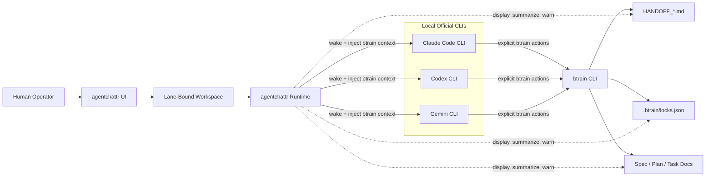

# Spec: agentchattr + btrain Lane-Governed Collaboration

**Status**: Draft
**Version**: 0.1.0
**Author**: btrain
**Date**: 2026-04-04

## Summary

`agentchattr` should become the conversational surface for multi-agent work while `btrain` remains the workflow authority. Claude Code CLI, Codex CLI, and Gemini CLI must launch and participate through their official local CLI authentication flows, with no API-key requirement in the primary integration path for Codex and Gemini. The intended path is the user's paid local CLI session, including subscription-backed Codex login and Gemini CLI login tied to the user's paid Google/Gemini plan. Agents should collaborate in lane-bound chat workspaces, but handoff files, spec docs, plan docs, and task docs remain the canonical source of truth.

The product goal is not generic agent chat. The goal is disciplined, spec-aligned, lane-safe collaboration where agents can discuss, coordinate, and hand off work in chat without drifting outside the `btrain` protocol.

## Workflow Diagram

## Related Workflow Dependency

This spec depends on a stronger `btrain` handoff lifecycle for review findings. If a reviewer finds blocking issues, the lane should return to the writer without being falsely marked resolved. That companion lifecycle is specified separately in [specs/005-review-findings-rework-loop.md](/Users/bfaris96/btrain/specs/005-review-findings-rework-loop.md).

## Clarifications

### Session 2026-04-04

- Q: How hard should btrain govern agentchattr behavior? -> A: Soft governance with warnings, preferred compliant actions, and human override.
- Q: Who should be allowed to change btrain state from inside agentchattr? -> A: Only agents invoking explicit btrain actions; agentchattr is not the authority.
- Q: How should btrain context reach agents in chat? -> A: Inject live btrain lane/status/lock/reviewer context whenever an agent is woken.
- Q: What is the primary work container inside agentchattr? -> A: Lane-bound workspaces for execution, with general chat reserved for coordination.
- Q: How should Claude/Codex/Gemini authentication work? -> A: Managed launcher plus health checks using official CLI login/session flows, not API-key-first integration.

## Goals

- Keep agents in their assigned `btrain` lanes while they collaborate in chat.
- Make lane ownership, reviewer responsibility, lock state, and source docs visible at the moment an agent acts.
- Let agents discuss work and perform handoffs through `agentchattr` while preserving `btrain` handoff files and spec docs as the source of truth.
- Support Claude Code CLI, Codex CLI, and Gemini CLI through local official CLI authentication flows, including subscription-backed Codex login and Gemini login tied to the user's paid plan.
- Reduce copy-paste relay work for the human operator without weakening workflow discipline.

## Non-Goals

- Replacing `btrain` with an `agentchattr`-native workflow engine.
- Creating a second authoritative lane, lock, or handoff model inside `agentchattr`.
- Making human UI buttons in `agentchattr` directly claim, update, or resolve `btrain` lanes.
- Requiring API keys as the default integration path for Codex CLI or Gemini CLI.
- Solving every existing provider integration in `agentchattr`; this spec focuses on Claude, Codex, Gemini, and their interaction with `btrain`.
- Using MCP as the agent integration layer (see Architecture Decision below).

## Architecture Decision: REST-Only Agent Integration (No MCP)

**Decision**: The new build phases out MCP entirely. All agent-to-agentchattr communication uses the existing REST API (`/api/*` endpoints on port 8300) and WebSocket transport. The MCP bridge (`mcp_bridge.py`), MCP proxy (`mcp_proxy.py`), and dual MCP transport servers (ports 8200/8201) are deprecated and will not be extended in the new implementation.

**Rationale**:

1. **Token cost**: MCP tool definitions are injected into every agent's context window on every turn. The 11 agentchattr MCP tools add significant prompt overhead just by existing in the agent's config — tokens spent before any useful work happens.
2. **Redundancy**: Every MCP tool is a thin wrapper around an existing REST endpoint. The REST API already supports full message send/read, agent registration, jobs, rules, schedules, sessions, and channels.
3. **Simpler integration**: REST endpoints work with any HTTP client. No MCP SDK dependency, no dual-transport compatibility concerns (streamable-http vs SSE), no per-instance proxy identity injection.
4. **Wrapper already works without MCP**: The `wrapper_api.py` path (used by local API agents) already registers via REST, polls queue files, and posts replies via `POST /api/send` with Bearer token auth — no MCP involved.

**Migration path for existing MCP features**:

| MCP feature | REST replacement |
|---|---|
| `chat_send(sender, text)` | `POST /api/send` with Bearer token |
| `chat_read(sender)` with cursor | `GET /api/messages?since_id=&channel=` (wrapper tracks cursor) |
| `chat_who()` | `GET /api/status` |
| `chat_rules()` | `GET /api/rules/active` |
| `chat_channels()` | Channel list via `GET /api/settings` |
| `chat_summary(read)` | `GET /api/summaries?channel=` (new endpoint — `summaries.py` has `get`/`get_all` but no REST route yet) |
| `chat_summary(write)` | `POST /api/summaries` with `{ channel, text }` (new endpoint — `summaries.py` has `write` but no REST route yet) |
| Identity injection (mcp_proxy) | Bearer token from `POST /api/register` identifies the agent |
| Dual transport (8200/8201) | Single REST API on port 8300 |

**Agent integration model after MCP removal**:

CLI agents (Claude Code, Codex, Gemini) interact with agentchattr through the wrapper, which acts as a thin REST client on their behalf:

1. **Wrapper registers** the agent via `POST /api/register` on startup, receives a Bearer token and assigned instance name.
2. **Wrapper injects context** into the agent's stdin when triggered by an @mention (queue file). The injected prompt includes the latest channel messages (fetched via `GET /api/messages`) and btrain lane context.
3. **Agent responds** in its terminal. The wrapper captures the output and posts it via `POST /api/send` with the Bearer token.
4. **Wrapper maintains presence** via `POST /api/heartbeat/{name}` every 5 seconds.

This is the same model `wrapper_api.py` already uses for local API agents. The key difference from MCP: agents never see agentchattr tool definitions in their context window. The wrapper handles all REST communication outside the agent's token budget.

For actions that agents previously performed via MCP tools (reading rules, checking who's online, reading summaries), the wrapper pre-fetches this context and includes it in the injected prompt when relevant, or agents can shell out to `curl` if they need on-demand access.

**What stays**: The REST API, WebSocket broadcast, wrapper stdin injection, queue-file triggering, and Bearer token auth. These already form the complete integration surface.

**What gets removed** (in implementation, not this spec phase): `mcp_bridge.py`, `mcp_proxy.py`, `run.py` MCP server startup, MCP port config in `config.toml`, MCP registration in wrapper scripts, `requirements.txt` MCP dependency.

## Source of Truth

The canonical workflow state must remain in:

- `.claude/collab/HANDOFF_*.md`
- `.btrain/project.toml`
- `.btrain/locks.json`
- the active feature spec, plan, and task documents for the lane
- repo instructions such as `AGENTS.md` and `CLAUDE.md`

`agentchattr` may read, summarize, and display this information, but it must not become a competing authority. If chat content and `btrain` docs disagree, the docs win.

## Primary Actors

- **Human operator**: starts agents, chooses the active repo/worktree, reviews collaboration, and redirects when needed.
- **Writer agent**: owns the active lane while status is `in-progress`.
- **Reviewer agent**: owns review work while status is `needs-review`.
- **agentchattr runtime**: brokers messages, wakes agents, injects context, and surfaces workflow warnings.
- **btrain runtime**: owns lane state, locks, handoff transitions, and repo-level workflow rules.

## User Scenarios

### 1. Writer works inside a lane-bound workspace

The human opens or resumes lane `b`. `agentchattr` creates or resumes a lane-bound workspace tied to that lane. When the writer agent is mentioned or triggered, the injected prompt includes lane id, task, owner, reviewer, status, locked files, and links or references to the canonical handoff/spec/plan docs. The agent works in that scope instead of treating the whole chat room as one undifferentiated task stream.

### 2. Reviewer receives a chat handoff without losing protocol discipline

The writer says the lane is ready for review in the lane workspace. The reviewer sees the discussion, but the actual review state still comes from `btrain`. The reviewer is directed to the canonical handoff context and is reminded that the lane is in `needs-review`, that the reviewer owns the next action, and that resolution must happen through explicit `btrain` actions rather than chat text alone.

### 3. Claude, Codex, and Gemini launch through official local auth

The human launches Claude, Codex, or Gemini from `agentchattr`. Each launcher checks whether the official CLI binary is present and whether the local authenticated session is usable. If the session is missing or expired, the launcher fails with a concrete recovery message. The primary path does not ask for `OPENAI_API_KEY` or Gemini API keys.

### 4. Cross-lane drift is caught before it becomes real damage

An agent in lane `h` starts discussing or attempting work that belongs to lane `g`, or references files that are locked by another lane. `agentchattr` does not hard-block the conversation, but it injects a warning and points the agent back to the current lane, current source docs, and current lock state.

### 5. Chat remains useful without becoming the spec

Agents can debate, ask each other questions, and coordinate handoffs in chat, but when they summarize intent they must point back to the actual handoff/spec/plan docs. Chat can explain, but docs decide.

### 6. Review findings send work back without losing lane continuity

The reviewer finishes a lane review and finds important issues. Instead of marking the lane resolved with findings buried in prose, the lane remains active, the findings are written into the canonical handoff context, and the writer is clearly made the next actor. `agentchattr` reflects that returned state in the lane workspace and wakes the writer with the reviewer findings plus the canonical doc references.

## Functional Requirements

### FR-1: Official CLI launch support

`agentchattr` must support launching Claude Code CLI, Codex CLI, and Gemini CLI as first-class local agents.

### FR-2: Subscription-backed or official local auth

The primary integration path for Codex CLI and Gemini CLI must use the user's official local CLI login/session flow rather than requiring API keys. Launchers must not require `OPENAI_API_KEY` or a Gemini API key to succeed on the default path, and must be designed for paid-session use rather than API-key-first setup.

### FR-3: Auth and readiness health checks

Before presenting an agent as available, the launcher layer must verify:

- the CLI binary exists
- the CLI session is authenticated and ready enough to run
- required wrapper-side dependencies are available
- the configured working directory is valid

Failures must be explicit and actionable, not silent.

### FR-4: Lane-bound workspaces

Each active `btrain` lane must be representable as a dedicated work context inside `agentchattr`. General chat may remain available for coordination, but implementation and review collaboration should happen in lane-bound workspaces.

### FR-4a: Channel-first lane containers

The first version of a lane workspace should be channel-first:

- `#general` remains the coordination channel
- each active lane maps to its own dedicated channel
- lane channels should be named by lane id alone, such as `#a`, `#b`, or `#h`

The lane container is reusable over time; the current task should appear in lane metadata or header state rather than in the channel name.

### FR-4b: Stable lane container with archived prior runs

Lane channels should remain stable across different tasks claimed into the same lane. When a lane receives new work, the active workspace should reset to the new current state while prior lane runs are archived rather than mixed indefinitely into the active conversation.

### FR-4c: Operational lane header

Each lane channel should expose an operational header or pinned state block containing at least:

- lane id
- current task
- current status
- active agent
- peer reviewer
- locked files
- next expected action
- source-document links or references
- compact summaries for the last 3 prior handoffs

The lane header should give humans and agents enough orientation to work safely without opening raw handoff files for every action.

### FR-4d: Jobs and sessions are optional within lanes

The lane channel itself is the primary workspace container. Existing `agentchattr` features such as jobs, threads, or structured sessions may be used inside a lane channel when they add value, but they should remain optional sub-tools rather than the mandatory substrate of lane execution.

### FR-5: Live btrain context injection

Whenever `agentchattr` wakes an agent for lane work, it must inject current `btrain` context, including at minimum:

- lane id
- task summary
- active agent
- peer reviewer
- current status
- locked files
- next expected workflow action
- references to the canonical handoff/spec/plan/task docs

### FR-6: Repo protocol reinforcement

Injected workflow context must reinforce repo rules that matter to lane safety, including:

- use `btrain` CLI commands rather than editing handoff files directly
- respect lane ownership and reviewer roles
- respect lock boundaries
- treat handoff/spec/plan docs as the source of truth
- refresh current `btrain` state before acting at major workflow transitions

### FR-7: Soft governance warnings

`agentchattr` must warn, highlight, or restate protocol when it detects likely workflow drift, including:

- an agent acting outside its assigned lane
- a reviewer behaving like the writer during `needs-review`
- a writer behaving like the reviewer when they no longer own the next step
- discussion or action that appears to conflict with another lane's locks
- chat assertions that conflict with current `btrain` state

Warnings should steer behavior without turning normal collaboration into constant hard-stop errors.

### FR-8: Agent-invoked btrain actions only

`agentchattr` must not become the authority for claiming, updating, or resolving lanes. Only agents invoking explicit `btrain` actions may change workflow state. Human operators may instruct agents in chat, but the state change itself must still come from an agent-side `btrain` action.

### FR-9: No authoritative mirrored workflow model

`agentchattr` may cache `btrain` state for display or prompt injection, but cached state must be clearly subordinate to the canonical repo files. The system must avoid acting as if its cache is authoritative when the repo state has changed.

### FR-10: Source-document grounding

Lane workspaces must make it easy for agents to orient against:

- handoff docs
- active spec
- active plan/tasks docs when present
- repo instruction docs

Chat summaries or reminders should reference those documents instead of replacing them.

### FR-10a: Recent handoff continuity

The active lane view should expose compact data from the last 3 prior handoffs for that same lane. This recent continuity is useful for short-horizon context, but it should remain compact and subordinate to the current handoff.

### FR-10b: Full history remains cold

Full lane history should remain available in archived form, but it should not be passed into normal agent memory or default prompt context. Full history exists for inspection, forensics, and guardian/doctor workflows rather than everyday lane execution.

### FR-11: Handoff discussion in chat

Agents must be able to discuss lane progress, request review, and coordinate reviewer attention in chat. However, a lane is not considered handed off or resolved merely because someone said so in chat; the `btrain` state transition remains the operative event.

### FR-12: Degraded-mode honesty

If `agentchattr` cannot read fresh `btrain` state, cannot validate auth, or cannot confirm the active source documents, it must surface that degraded condition instead of pretending the lane context is current.

## Non-Functional Requirements

### Safety and Trust Boundaries

- The integration must preserve the trust boundary that `btrain` owns workflow state and docs.
- It must not expand secrets handling just to support Codex or Gemini. The primary CLI path should rely on official local sessions instead of extra API-key plumbing.
- It must remain understandable to the human operator; lane ownership and next action must be inspectable without reading raw implementation code.

### Reliability

- Agent launch behavior must fail fast with actionable recovery guidance.
- Lane workspaces must survive normal restarts well enough to resume collaboration against the same canonical docs.
- When `btrain` state changes, injected context should refresh often enough to avoid obvious stale guidance.

### Observability

The system should make it possible to inspect:

- which lane an agent believes it is working on
- which canonical docs were referenced for that wake-up
- whether the agent was acting as writer or reviewer
- whether the integration detected stale or conflicting state

## Acceptance Criteria

- A human can launch Claude, Codex, and Gemini from `agentchattr` on the primary path without configuring provider API keys for Codex or Gemini.
- If Codex or Gemini auth is missing or expired, the launcher reports a concrete fix instead of silently failing or pretending the agent is available.
- An agent triggered inside a lane workspace receives current lane, reviewer, status, lock, and source-document context from `btrain`.
- Lane collaboration in chat is clearly scoped to a lane workspace rather than mixed into one global execution stream.
- `agentchattr` can discuss or suggest handoffs in chat, but canonical lane state still changes only through explicit `btrain` actions invoked by agents.
- If chat behavior appears to cross lanes or ignore locks, `agentchattr` surfaces a workflow warning rather than staying silent.
- If `agentchattr` loses confidence in the freshness of `btrain` state, it marks the lane context as degraded rather than presenting cached data as authoritative.

## Assumptions

- The repo will continue to use `btrain` as its workflow authority.
- Claude, Codex, and Gemini each have or will have an official local CLI login/session flow that can be checked without requiring API-key-first setup, including the paid-session paths the user already wants to rely on.
- The first version uses channels as the lane workspace primitive (FR-4a). Jobs, sessions, and other bounded contexts remain available as optional sub-tools within lane channels (FR-4d), but the channel is the primary container.
- Existing non-primary providers in `agentchattr` may continue to exist, but they are out of scope for this feature unless they later adopt the same `btrain` governance contract.

## Deferred Design Decisions

- Whether to bootstrap full `.specify/` Spec Kit scaffolding for this repo or continue using `specs/` with spec-kit-style documents.
- The exact lane-channel header layout and archived-history UX within the channel-first model.
- Whether lock-conflict detection should be based only on lane metadata and prompts, or also on stronger repo/file telemetry.
- Whether review-phase constraints should remain purely advisory or escalate to stronger intervention in later versions.

## Open Risks

- Provider CLI auth flows may differ across versions, especially for Codex and Gemini subscription-backed login behavior.
- If `agentchattr` injects stale lane context, the system could create false confidence even while trying to improve discipline.
- If lane workspaces are too soft, agents may still drift; if they become too rigid, collaboration may become cumbersome.

## Success Criteria

- Human operators can run Claude, Codex, and Gemini in `agentchattr` as local CLI agents without falling back to API-key integration for the primary workflow.
- Agents collaborating in chat show materially better lane discipline than today's freeform chat behavior.
- Review handoffs discussed in chat remain aligned with actual `btrain` state and reviewer context.
- Agents consistently reference canonical handoff/spec/plan docs instead of inventing parallel chat-only state.
