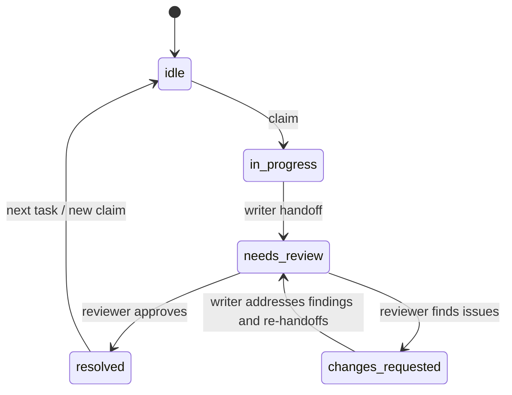
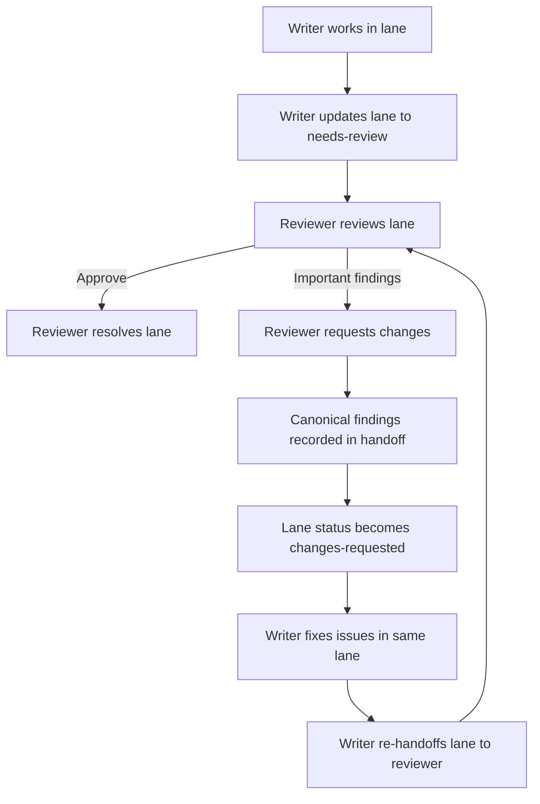

# Spec: Review Findings Rework Loop for btrain

**Status**: Draft
**Version**: 0.1.0
**Author**: btrain
**Date**: 2026-04-04

## Summary

`btrain` currently has a clean path for:

- writer starts work
- writer hands to reviewer
- reviewer resolves the lane

It does not yet have an explicit, first-class state for the equally common path where the reviewer finds important issues and the lane must return to the writer. That gap makes handoffs less trustworthy because the reviewer can either:

- mark the lane resolved even though work is still required, or
- push the lane back to `in-progress` and lose the semantic fact that a review occurred and requested changes

This spec adds a first-class review-return state so findings remain canonical, the next actor is unambiguous, and the same lane can cycle cleanly between writer and reviewer until it is truly resolved.

This review-return path should carry both a machine-readable reason code and a short human summary so orchestration, dashboards, and repair tools can classify the return consistently without relying on freeform prose alone.

## Recommendation

Use a new active lane status: **`changes-requested`**.

This is preferable to reusing `needs-review` because `needs-review` means the reviewer acts next. It is preferable to reusing `in-progress` because `in-progress` hides the fact that the lane already went through review and failed that review gate.

## State Diagram



## Problem Statement

The current workflow leaves an orchestration hole:

- the reviewer can identify real issues
- the lane is not actually done
- the writer should act next
- the findings need to remain canonical and review-visible

Without an explicit state for this path, agents and humans have to improvise. Improvised review returns are exactly where multi-agent workflows become ambiguous, stale, and unsafe.

## Goals

- Make reviewer-requested rework a first-class workflow state.
- Preserve lane continuity when review fails.
- Keep the reviewer findings in the canonical handoff record.
- Make the next actor explicit for humans, `bth`, the loop engine, dashboards, and `agentchattr`.
- Prevent a lane from being marked resolved when it still has blocking findings.

## Non-Goals

- Building a full threaded code-review system inside `btrain`.
- Supporting multiple simultaneous reviewers on a single lane in this iteration.
- Replacing the existing `needs-review` handoff flow for happy-path approvals.
- Encoding every review finding as structured per-line metadata.

## Proposed Status Model

The lane lifecycle becomes:

- `idle`
- `in-progress`
- `needs-review`
- `changes-requested`
- `resolved`

Status semantics:

- `idle`: no active work
- `in-progress`: writer acts next
- `needs-review`: reviewer acts next
- `changes-requested`: writer acts next because the reviewer found blocking issues
- `resolved`: lane is complete

## Workflow Diagram



## Functional Requirements

### FR-1: First-class review-return status

`btrain` must support a first-class active lane status named `changes-requested`.

### FR-2: Reviewer findings keep the lane active

When the reviewer finds blocking or important issues, the lane must remain active rather than being marked resolved.

### FR-3: Explicit next actor after failed review

When a lane enters `changes-requested`, the writer becomes the next actor. Guidance from `btrain handoff`, `bth`, loop dispatch, status output, and dashboards must all reflect that the writer acts next.

### FR-4: Reviewer findings are canonical

The reviewer's findings must be written into the canonical handoff record in a way that remains visible for the writer, the reviewer, and later audit/history. Findings must not live only in terminal output or ad hoc chat text.

### FR-5: Reviewer identity is preserved

The lane must keep the same reviewer identity after `changes-requested` unless the handoff is explicitly reassigned. Rework should return to the same reviewer by default.

### FR-6: Same-lane rework loop

The writer must address findings in the same lane rather than resolving the lane and opening a brand-new lane for the same slice of work.

### FR-7: Clean re-handoff path

After addressing findings, the writer must be able to move the same lane back to `needs-review` with refreshed reviewer context and verification notes.

### FR-8: CLI support for review return

`btrain` must provide an explicit CLI path for reviewers to send a lane back with findings. A dedicated command is preferred over overloading `resolve`.

Recommended command:

```bash
btrain handoff request-changes --lane <id> --summary "..." --actor "<reviewer>"
```

Optional follow-on structured flags may include repeatable `--finding`, required `--reason-code`, and `--next`.

### FR-9: `resolve` remains approval-oriented

`btrain handoff resolve` should remain the terminal approval/completion path. Review return should not pretend to be resolution.

### FR-10: Active lock treatment

`changes-requested` must count as an active lane status for lock purposes. The lane's locks remain active and owned by the lane while the writer addresses findings.

### FR-11: Loop routing compatibility

Any loop or status-to-actor mapping in `btrain` must route `changes-requested` to the writer, not the reviewer.

### FR-12: Dashboard and status visibility

`btrain status`, `btrain handoff`, and any dashboard integrations must display `changes-requested` distinctly from both `in-progress` and `needs-review`.

### FR-13: Review audit clarity

History and current state must make it obvious that:

- a review already happened
- the reviewer found issues
- the lane is still open
- the writer is addressing those issues

### FR-14: `bth` guidance correctness

When the active lane is `changes-requested`, `bth` guidance must tell the writer to address findings and re-handoff, not to claim a new task or wait for the reviewer.

### FR-15: Reason code plus human summary

When a reviewer sends a lane to `changes-requested`, the action must capture:

- a required machine-readable primary reason code
- a short human-readable summary
- optional detailed findings

The primary reason code should support reliable downstream classification while the summary remains readable to humans.

### FR-16: Review-return taxonomy

`changes-requested` should support a bounded review-return taxonomy. The first version should stay intentionally small, with primary codes such as:

- `spec-mismatch`
- `regression-risk`
- `missing-verification`
- `security-risk`
- `integration-risk`

Nuance such as docs issues, unclear instructions, tests, or code-quality concerns should usually live in optional secondary tags rather than expanding the primary-code set too early. Exact taxonomy names may evolve, but the return path must be structured enough for dashboards, guards, and analytics to distinguish why the lane came back.

### FR-17: Primary code plus optional tags

Each `changes-requested` event should carry:

- one required primary reason code
- zero or more optional secondary tags

The primary code should drive workflow classification. Secondary tags may capture additional nuance without making the return path ambiguous.

## Rejected Alternatives

### Reuse `needs-review`

Rejected because `needs-review` means the reviewer acts next, which is false after findings are returned.

### Reuse `in-progress`

Rejected because it erases the semantic fact that the lane already went through review and came back with findings. That weakens auditability and makes orchestration less precise.

### Resolve with findings in summary text

Rejected because it makes the lane look complete even though additional work is required. This is exactly the ambiguity the spec is trying to remove.

## Acceptance Criteria

- Reviewers can return a lane with important findings without marking it resolved.
- Returned lanes show a distinct `changes-requested` status.
- `btrain handoff` clearly indicates that the writer acts next on `changes-requested`.
- The lane remains active and keeps its lock coverage while the writer addresses findings.
- The writer can re-handoff the same lane back to `needs-review` after addressing the findings.
- The same reviewer remains attached by default across the rework cycle.
- Dashboards, loop logic, and any status-based agent routing treat `changes-requested` as a distinct state.
- A returned review always includes a machine-readable reason code and a short human-readable summary.

## Assumptions

- A reviewer-return action will remain lane-scoped and human-readable.
- Current handoff docs already have enough structure to store a canonical reviewer summary, even if the fields need to be expanded later.
- Existing repos can migrate to the new status without changing the conceptual meaning of `idle`, `in-progress`, `needs-review`, or `resolved`.

## Open Questions

- Whether the dedicated command should be named `request-changes`, `return`, or something else.
- Whether reviewer findings should support repeatable structured bullets in the CLI on day one or start with a required summary plus reason code only.
- Whether `changes-requested` should alter pre-commit behavior in any way beyond the normal active-lane lock rules.
- Exact secondary tags to support in the first version of the review-return taxonomy.

## Success Criteria

- Review findings no longer force humans or agents to improvise lane state.
- A reviewer with blocking findings never has to misuse `resolve` to communicate that the lane is not done.
- Writer/reviewer ownership remains unambiguous through repeated review-rework cycles.
- Multi-agent orchestration becomes more trustworthy because handoff state matches reality at every step.
