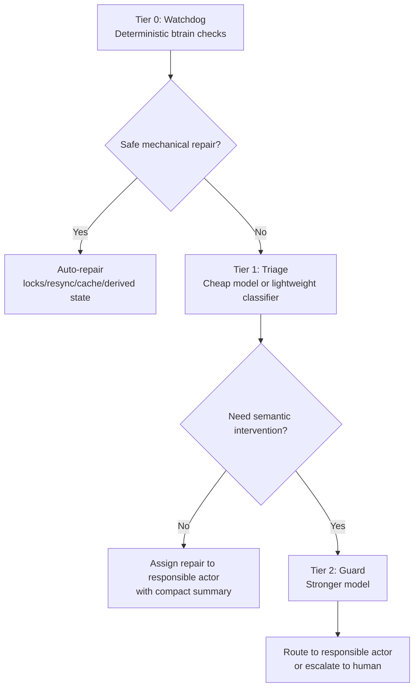
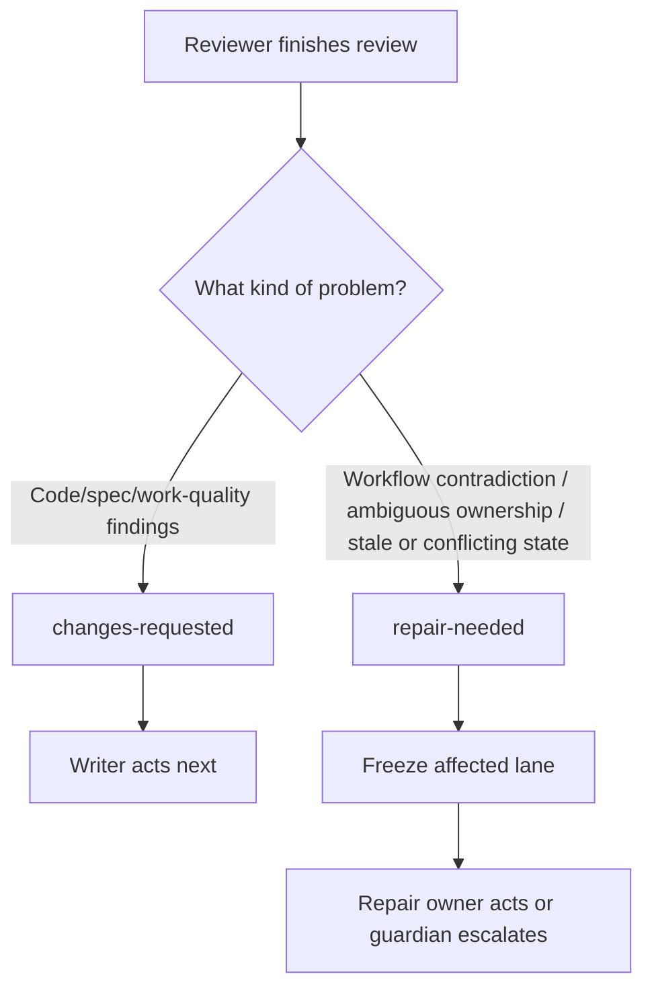

# Spec: btrain Workflow Resilience and Guardian Recovery

**Status**: Draft
**Version**: 0.1.0
**Author**: btrain
**Date**: 2026-04-04

## Summary

`btrain` should become self-healing for common workflow drift and explicit about failure when workflow integrity is no longer trustworthy. The system should use a three-layer recovery architecture:

- deterministic watchdog checks first
- cheap triage when classification or summarization is needed
- a stronger guard only when intervention is necessary

This spec defines how `btrain` distinguishes healthy rework from broken workflow, how it assigns repair ownership, what it auto-repairs safely, how it escalates, and how it preserves token efficiency by keeping detailed recovery history out of normal agent context.

This spec complements:

- [specs/004-agentchattr-btrain-governance.md](/Users/bfaris96/btrain/specs/004-agentchattr-btrain-governance.md)
- [specs/005-review-findings-rework-loop.md](/Users/bfaris96/btrain/specs/005-review-findings-rework-loop.md)

## Clarifications

### Session 2026-04-04

- Q: Should resilience rely on hard-coded rules or a police agent? -> A: Hybrid. `btrain` enforces invariants and safe self-repair, while a guardian watches, warns, routes harder repairs, and escalates.
- Q: What should auto-repair cover? -> A: Safe mechanical repairs only. If repair is not confidently safe, route it back to the last responsible agent or escalate.
- Q: What state should a workflow-integrity failure enter? -> A: `repair-needed`.
- Q: Should the review-return state exist separately? -> A: Yes. Use `changes-requested` for normal review findings.
- Q: Who can route a broken lane back to the responsible actor? -> A: Guardian can do so, but unresolved or unclear cases escalate to a human.
- Q: Who is the responsible actor? -> A: The last canonical workflow actor recorded by `btrain`, with git used as corroborating evidence.
- Q: Should workflow event history exist? -> A: Yes, but as cold structured memory, not default prompt context.
- Q: Who can access raw event history? -> A: Guardian/doctor first; normal agents get compact summaries unless explicitly assigned repair work.
- Q: What should `repair-needed` freeze? -> A: The affected lane only, unless the failure is systemic.
- Q: When does failure become repo-wide? -> A: Only for shared-state or systemic workflow corruption.
- Q: Should recovery be layered? -> A: Yes. Watchdog, then triage, then full guard.
- Q: When should the full guard wake? -> A: Only when self-repair failed, responsibility is ambiguous, the same lane keeps failing, or semantic/shared workflow state is affected.
- Q: When should blocked review become `changes-requested` vs `repair-needed`? -> A: `changes-requested` for healthy code/spec rework, `repair-needed` for workflow contradictions or unsafe state.
- Q: Who can clear `repair-needed`? -> A: Responsible agent by default, with guardian or human override.
- Q: When should human escalation happen? -> A: One retry budget. Route to the responsible agent once; if the lane re-enters `repair-needed` again or guard intervention still cannot resolve it, escalate.
- Q: Where should repair summaries live? -> A: Split storage. Short canonical repair summary in the handoff; detailed evidence and repair history in the cold event log.
- Q: What happens to locks during `repair-needed`? -> A: Keep the lane's current locks by default; guardian or human may explicitly rescope or release them if recovery requires it.
- Q: What if the responsible repair actor is unavailable? -> A: Try to restore the same actor/session first; if impossible, guardian may reassign to an equivalent backup actor with a recorded reason, else escalate.
- Q: What counts as an equivalent backup actor? -> A: Same agent family first. Prefer another instance of the same provider/family; otherwise escalate or use an explicitly recorded fallback.
- Q: Should failure classification use freeform summaries only or structured codes too? -> A: Hybrid. Require a machine-readable reason code plus a short human summary.
- Q: Should blocked workflow actions ever be overridable? -> A: Yes, but only through an explicit audited override path with required reason and traceability.
- Q: Who can authorize an audited override? -> A: Agent or guardian may request it, but a human must confirm before execution.
- Q: How much recent handoff history should stay warm? -> A: Keep the last 3 prior handoffs visible in compact form; keep full history cold.
- Q: Should cleanup reuse `btrain hcleanup` or replace it? -> A: Reuse and upgrade `btrain hcleanup` as the compaction mechanism.
- Q: When should cleanup run? -> A: Run on lane transitions first, with periodic watchdog cleanup as a backstop.
- Q: Should the watchdog identify which lanes are fully done, stale, and ready to be repurposed? -> A: Yes. The watchdog should classify and surface repurpose-ready lanes from canonical workflow state so humans and agents can safely recycle reusable lane containers.

## Problem Statement

Current handoff workflows assume agents mostly follow the happy path. Real collaboration fails in messier ways:

- stale locks after crashes
- mismatched lane status and lock state
- malformed or incomplete review handoffs
- pushes that happen before required review
- reviewer findings returned in prose but not in canonical state
- contradictory chat claims about who acts next
- incorrect actor performing the next transition
- repeated repair attempts that never restore a healthy lane
- resolved lanes lingering with no clear operational signal that they are stale and safe to repurpose

Without a resilience architecture, these failures become ambiguous human cleanup work. That undermines trust in `btrain` precisely when the workflow is under stress.

## Goals

- Detect workflow drift and contradictions early.
- Auto-repair only safe mechanical inconsistencies.
- Distinguish healthy review rework from broken workflow integrity.
- Route hard repair tasks to the right actor by default.
- Escalate to a human only when needed.
- Keep recovery evidence auditable without polluting normal agent context.
- Surface which completed lanes are stale and safe to repurpose.

## Non-Goals

- Using an LLM as the primary workflow authority.
- Letting the guard silently rewrite important workflow meaning without traceability.
- Injecting full workflow event history into everyday prompts.
- Freezing the whole repo for normal lane-local failures.

## Recommended State Model

`btrain` should support:

- `idle`
- `in-progress`
- `needs-review`
- `changes-requested`
- `repair-needed`
- `resolved`

State semantics:

- `changes-requested`: healthy lane, workflow intact, writer acts next
- `repair-needed`: unhealthy lane, workflow integrity uncertain, normal lane work pauses until repaired

## Recovery Architecture

## Workflow Decision Diagram

## Functional Requirements

### FR-1: Deterministic watchdog

`btrain` must provide a deterministic watchdog layer that continuously or on-demand checks for workflow integrity issues without requiring an LLM.

### FR-2: Safe auto-repair catalog

The watchdog may auto-repair only mechanical or derived-state problems that do not change workflow meaning, including examples such as:

- stale lock cleanup
- lock/status resync
- derived cache refresh
- restoring missing non-semantic metadata from canonical state

### FR-2a: Invalid handoffs should fail before transition

`btrain handoff update --status needs-review` should hard-fail when the handoff payload is malformed or incomplete, including cases such as:

- required reviewer context missing
- placeholder text still present
- no real diff or authored commit range
- missing verification record
- invalid reviewer assignment

These failures should be blocked at transition time rather than treated as ordinary review work.

### FR-2b: Unreviewed pushes should fail before remote update

`btrain` should provide a pre-push guard that blocks pushes containing unresolved lane-owned work by default. Preventing the push is preferred to detecting the violation afterward.

### FR-2c: Explicit audited override path

When a blocked action must proceed anyway, `btrain` should provide a dedicated audited override path rather than relying on generic bypasses such as `--no-verify`. Any override path must capture:

- who invoked it
- what action was overridden
- why the override was necessary
- when it happened
- the affected lane or repo scope

The override event must be written into canonical workflow history so later diagnosis and review can see that the guardrail was intentionally bypassed.

### FR-2d: Human-confirmed override authority

The audited override path should follow a human-confirmed model:

- the responsible agent may request an override
- the guardian may request an override
- a human must confirm the override before it executes

This keeps emergency recovery available without turning guardrails into self-serve agent bypasses.

### FR-3: No silent semantic repair

The watchdog must not silently change semantic workflow meaning, including:

- actor responsibility
- reviewer assignment
- lane ownership
- final approval/completion state
- whether a lane is healthy or broken

### FR-4: `repair-needed` state

`btrain` must support a first-class `repair-needed` lane status for workflow-integrity failures.

### FR-5: Lane-local freeze by default

When a lane enters `repair-needed`, normal writer/reviewer flow for that lane must pause. Other unrelated lanes may continue unless the failure is systemic.

### FR-6: Systemic incident escalation

Repo-wide incident handling should occur only when the failure affects shared workflow truth, such as:

- corrupted lock registry
- contradictory active ownership across lanes
- broken lane map or shared config state
- shared derived state that cannot be reconciled confidently

### FR-7: Responsible actor assignment

When a repair is not safely auto-fixable, `btrain` must assign repair responsibility to the most recent canonical workflow actor recorded by `btrain`, not the most recent chat participant.

### FR-8: Git as corroborating evidence

Git status, diff, and commit evidence should be used to corroborate repair diagnosis and ownership, but git alone must not be the primary authority for workflow responsibility.

### FR-9: Structured workflow event log

`btrain` must maintain a structured event log for lane workflow actions and repair events. This log should support:

- actor attribution
- event ordering
- recovery diagnostics
- guardian and doctor investigation
- audit of repair attempts and outcomes

### FR-10: Cold memory policy

The structured workflow event log must not be injected into normal writer/reviewer prompt context by default.

### FR-11: Guardian-first access policy

Raw event-log access is primarily for watchdog, doctor, and guardian paths. Normal agents should receive compact summaries unless they are explicitly assigned repair work.

### FR-12: Triage layer

The resilience system may use a cheaper triage layer to summarize or classify failures when deterministic checks are insufficient, but triage must not become the workflow authority.

### FR-12a: Repurpose-ready lane detection

The deterministic watchdog should classify lanes that are fully done, stale, and safe to repurpose. This classification must come from canonical workflow state rather than chat content.

At minimum, repurpose-ready classification should require:

- lane status is `resolved` or `idle`
- no active locks remain
- no outstanding `needs-review`, `changes-requested`, or `repair-needed` state remains attached to that lane
- no unresolved audited override or repair flow is still active for that lane
- the lane has either aged past a configurable staleness threshold or was explicitly cleared, discarded, or superseded by the operator

This signal is advisory. It marks the lane as safe to recycle; it does not silently claim new work into the lane.

### FR-12b: Repurpose-ready visibility

`btrain` should surface repurpose-ready lanes in operational outputs such as status, doctor, watchdog output, and any downstream dashboard or `agentchattr` summary that helps the operator choose the next reusable lane.

The surfaced signal should make it clear:

- which lanes are repurpose-ready now
- why they were considered safe to recycle
- whether the readiness came from normal staleness aging or an explicit clear/supersede action

### FR-13: Guard wake conditions

The full guard should wake only when one or more of the following are true:

- safe self-repair failed
- responsibility is ambiguous
- the same lane repeatedly fails
- semantic workflow intervention is needed
- shared/systemic workflow state may be compromised

### FR-14: Guardian repair authority

The guard may:

- inspect the relevant event-log slice
- inspect targeted git evidence
- run safe doctor-style repairs
- assign a `repair-needed` lane back to the responsible actor
- escalate to a human when repair is unclear or repeatedly unsuccessful

The guard should not silently become the workflow authority for all lane semantics.

### FR-15: Clearing `repair-needed`

`repair-needed` should normally be cleared by the responsible repair actor. Guardian or human override is allowed when responsibility is unclear, the responsible actor failed to repair it, or the guardian can confirm recovery safely.

### FR-16: Compact repair summaries

When routing a repair task, `btrain` or the guardian must produce a compact summary including:

- why the lane entered `repair-needed`
- who is responsible
- what evidence was considered
- what exact next action should happen

### FR-17: Recovery history visibility

It must be possible for human operators to inspect whether:

- the lane auto-repaired successfully
- the lane was routed back to an agent
- the lane needed human escalation
- the same failure pattern repeated
- a blocked action was allowed through an audited override

### FR-18: One retry budget before human escalation

For non-systemic workflow failures, `btrain` should normally allow one meaningful repair attempt by the responsible actor. If the same lane re-enters `repair-needed` again for the same unresolved problem, or if guardian intervention still cannot restore healthy state, the lane must escalate to a human.

### FR-19: Split repair storage model

`btrain` must store:

- a short canonical repair summary in the handoff/current lane view
- detailed evidence, repair attempts, guardian actions, and git corroboration in the cold event log

### FR-20: Lock retention during `repair-needed`

When a lane enters `repair-needed`, its existing locks should remain in place by default so the broken lane stays contained. Guardian or human override may explicitly rescope or release those locks when the repair procedure requires it.

### FR-21: Unavailable-actor fallback

If the responsible repair actor is unavailable, `btrain` and the guardian must:

1. try to restore the same actor/session first
2. if that fails, optionally reassign to an equivalent backup actor with an explicit recorded reason
3. escalate to a human if equivalence is unclear or recovery still cannot proceed safely

### FR-22: Backup equivalence policy

When fallback reassignment is needed, the preferred backup order is:

1. another active instance of the same agent family/provider
2. an explicitly approved fallback actor recorded with reason and provenance
3. human escalation if safe equivalence cannot be established

This policy should preserve runtime/tooling similarity before considering broader peer reassignment.

### FR-23: Reason code plus human summary

When a lane enters `repair-needed`, `btrain` must record:

- a required machine-readable primary reason code
- a short human-readable repair summary
- optional detailed diagnostic evidence in the cold event log

### FR-24: Repair-needed taxonomy

`repair-needed` should support a bounded workflow-failure taxonomy, with an initial set such as:

- `stale-locks`
- `actor-mismatch`
- `invalid-transition`
- `invalid-handoff`
- `unreviewed-push`
- `conflicting-state`
- `missing-reviewer`
- `cache-or-derived-drift`
- `unavailable-actor`
- `systemic-corruption`

The taxonomy must be structured enough for watchdog, triage, guard, dashboards, and later analytics to reason about failure classes consistently.

### FR-25: Primary code plus optional tags

Each `repair-needed` event should carry:

- one required primary failure code
- zero or more optional secondary tags

The primary code should drive workflow routing and escalation logic. Secondary tags may capture contributing conditions without making repair ownership or lane state ambiguous.

### FR-26: Warm-vs-cold handoff history

`btrain` should maintain a warm/cold split for prior handoff history:

- the current lane view should retain compact access to the last 3 prior handoffs
- older handoff history should be compacted into cold archive storage

This preserves useful short-horizon context without making the active handoff surface or agent prompts grow unbounded.

### FR-27: Reuse and evolve `hcleanup`

The existing `btrain hcleanup` mechanism should remain the canonical compaction path for trimming warm handoff history into archive storage. The resilience system should extend and automate this mechanism rather than inventing a second incompatible cleanup workflow.

### FR-28: Transition-first cleanup with periodic backstop

History compaction should run primarily on lane lifecycle transitions such as:

- lane resolve
- new claim into a previously used lane
- other safe handoff-boundary transitions

The watchdog may also run periodic cleanup as a backstop when transition-based cleanup was missed or state drift accumulated.

## Edge Case Categories

The resilience architecture must explicitly handle at least these classes:

### State-machine failures

- reviewer finds issues but lane is marked `resolved`
- actor performs an action inconsistent with the current status
- lane transitions skip a required phase
- malformed handoff marked review-ready

### Lock failures

- stale locks after crash or dropped session
- lock file and lane status disagree
- overlapping active locks across lanes

### Ownership failures

- wrong actor attempts a transition
- reviewer/writer role confusion
- multi-instance identity drift causing the wrong actor attribution

### Source-of-truth failures

- chat claims contradict canonical docs
- stale cached state appears current
- event history and current snapshot disagree
- a push lands remotely even though canonical review state is incomplete

### Repeated-failure loops

- the same lane repeatedly enters `repair-needed`
- the same actor repeatedly fails repair
- self-repair oscillates without restoring healthy state

### Lane-reuse readiness failures

- resolved lanes remain visually ambiguous even though they are safe to recycle
- stale lanes are not surfaced, so operators reuse or avoid lanes inconsistently
- a lane is treated as repurpose-ready even though unresolved review, repair, or lock state still exists

## Acceptance Criteria

- `btrain` can distinguish healthy review rework (`changes-requested`) from broken workflow (`repair-needed`).
- Safe mechanical drift is repaired automatically without semantic guesswork.
- Malformed review handoffs are blocked before they become `needs-review`.
- Pushes containing unresolved lane-owned work are blocked by default before they leave the repo.
- Emergency exceptions use a dedicated audited override path instead of ad hoc bypasses.
- Audited overrides require human confirmation even when requested by the responsible agent or guardian.
- Unsafe or ambiguous failures are assigned to the last canonical workflow actor by default.
- Git is used as corroborating evidence during diagnosis, not as the sole workflow authority.
- Raw workflow event history is available to watchdog/doctor/guardian without being injected into normal prompts.
- A lane in `repair-needed` freezes only that lane unless systemic corruption is detected.
- Shared/systemic failures can escalate beyond a single lane.
- Repeated or ambiguous failures wake the full guard rather than looping forever in cheap auto-repair.
- Human escalation happens after one meaningful failed repair cycle rather than after endless automated retries.
- Resolved or idle lanes that have become stale are surfaced as repurpose-ready without manual inspection of every lane.
- Repair summaries remain visible in the handoff while detailed diagnostics stay in cold storage.
- `repair-needed` retains its existing locks by default until repair ownership resolves the lane or an explicit override changes lock scope.
- Unavailable repair owners prefer same-family backup assignment before broader fallback or human escalation.
- Every `repair-needed` lane carries both a structured failure code and a short human-readable summary.
- Warm handoff history remains compacted to the last 3 entries in active lane view while full history is preserved in cold archive storage.
- Cleanup automation builds on `btrain hcleanup` rather than replacing it with a second archival system.

## Assumptions

- `btrain` can persist structured workflow events under `.btrain/` without making them part of normal prompt context.
- The guardian can operate on compact summaries and targeted evidence instead of full-repo context.
- Human operators remain the final escalation point for ambiguous or repeated failures.

## Open Questions

- How many repeated failures on the same lane should trigger guaranteed human escalation?
- Whether the triage layer should always be a model or may also be partly deterministic classification.
- What kinds of cross-family fallback should ever be allowed, if same-family backup is unavailable.
- Exact secondary tags to support in the first version of the repair-needed taxonomy.
- Exact UX for requesting and confirming an audited override.
- Exact archive format and retrieval UX for older handoff runs beyond the warm last-3 view.

## Success Criteria

- Workflow screw-ups become diagnosable and recoverable instead of ambiguous manual cleanup.
- Normal lane work remains cheap in context and token cost.
- The guard is invoked rarely, but when invoked it has enough evidence to act decisively.
- Multi-agent handoffs become more trustworthy because broken workflow is surfaced explicitly rather than hidden behind stale state.
