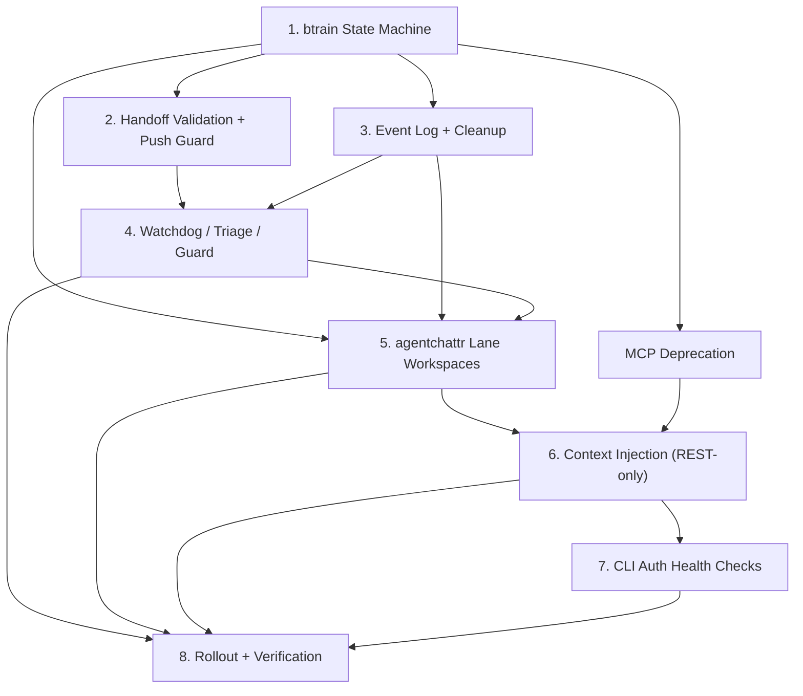

# Plan: Implement agentchattr + btrain Governed Collaboration

**Status**: Draft
**Version**: 0.1.0
**Author**: btrain
**Date**: 2026-04-04

## Summary

This plan turns the three draft specs into an implementation sequence that can be reviewed and executed in stages:

- [specs/004-agentchattr-btrain-governance.md](/Users/bfaris96/btrain/specs/004-agentchattr-btrain-governance.md)
- [specs/005-review-findings-rework-loop.md](/Users/bfaris96/btrain/specs/005-review-findings-rework-loop.md)
- [specs/006-workflow-resilience-and-guardian.md](/Users/bfaris96/btrain/specs/006-workflow-resilience-and-guardian.md)

The implementation goal is not just to bolt `agentchattr` onto the repo. It is to make `agentchattr` a useful collaboration surface while keeping `btrain` as the workflow authority, preserving lane discipline, and adding self-repair for the workflow failures that currently burn operator time.

## Review Goals

Review this plan for:

- missing workflow edge cases
- incorrect sequencing between `btrain` core changes and `agentchattr` UI/runtime changes
- unnecessary scope in the first release
- missing tests or rollback points
- any place where the plan accidentally creates a second source of truth outside `btrain`

## Implementation Principles

- `btrain` remains authoritative for lane state, locks, handoff transitions, and repair history.
- `agentchattr` may display or summarize workflow state, but it must not become a competing workflow engine.
- Deterministic checks come before model-based recovery.
- Rich history stays cold; active lane context stays compact.
- Invalid workflow actions should fail early rather than relying on review or humans to clean them up later.
- The first version should prefer a narrow, auditable feature set over a clever but hard-to-debug orchestration layer.
- **REST-only agent integration**: all agent-to-agentchattr communication uses the REST API and WebSocket transport. MCP is phased out entirely to eliminate per-turn token overhead from tool definitions and remove redundant protocol layers. See spec 004 Architecture Decision for full rationale and migration table.

## First-Version Decisions

### Review-return primary reason codes

The first version should keep `changes-requested` primary codes intentionally small:

- `spec-mismatch`
- `regression-risk`
- `missing-verification`
- `security-risk`
- `integration-risk`

Secondary tags can add nuance without expanding the routing surface. Suggested initial tags:

- `docs`
- `instructions`
- `tests`
- `code-quality`

### Repair-needed primary reason codes

The first version of `repair-needed` should support primary codes such as:

- `stale-locks`
- `actor-mismatch`
- `invalid-transition`
- `invalid-handoff`
- `unreviewed-push`
- `conflicting-state`
- `missing-reviewer`
- `cache-or-derived-drift`
- `unavailable-actor`
- `systemic-corruption`

### Command naming

The first version should standardize on:

- `btrain handoff request-changes`
- `changes-requested`
- `repair-needed`

### MCP phase-out

The new build removes MCP as an agent integration layer. All agent communication goes through the REST API (`/api/*` on port 8300) and WebSocket transport. Files to deprecate: `mcp_bridge.py`, `mcp_proxy.py`, MCP server startup in `run.py`, MCP port config in `config.toml`, MCP registration in wrapper scripts, and the `mcp` dependency in `requirements.txt`. The wrapper's REST path (`wrapper_api.py` pattern) becomes the canonical agent integration model. See spec 004 Architecture Decision for full rationale and migration table.

### Lane recycling signal

The first version should also expose a watchdog-driven `repurpose-ready` lane signal derived from canonical lane state. This is not a new lane status. It is an operational classification that marks resolved or idle lanes as safe to recycle once they are stale and clean.

## Dependency Diagram

## Workstreams

### Workstream 1: Extend the btrain state machine

**Goal**: add the missing workflow states and actor routing before adding higher-level automation.

**Skill hints**: `test-writer` for state transition and actor-routing tests, `reflect` if regressions surface during state machine changes, `code-simplifier` after implementation before handoff, `pre-handoff` before moving to review.

**Primary changes**

- add `changes-requested` as a first-class active review-return state
- add `repair-needed` as a first-class workflow-integrity state
- add `btrain handoff request-changes`
- update status-to-next-actor routing so:
  - `in-progress` routes to writer
  - `needs-review` routes to reviewer
  - `changes-requested` routes to writer
  - `repair-needed` routes to assigned repair owner or human escalation path
- update handoff rendering and summaries so these states are visible and unambiguous

**Likely files**

- [src/brain_train/core.mjs](/Users/bfaris96/btrain/src/brain_train/core.mjs)
- [src/brain_train/cli.mjs](/Users/bfaris96/btrain/src/brain_train/cli.mjs)
- [README.md](/Users/bfaris96/btrain/README.md)

**Tests**

- state transition coverage
- actor-routing coverage
- `bth` guidance coverage for `changes-requested` and `repair-needed`
- backward-compat coverage for existing `idle/in-progress/needs-review/resolved` lanes

### Workstream 2: Enforce handoff and push guardrails

**Goal**: stop the common workflow failures before they spread.

**Skill hints**: `secure-by-default` for the push guard and override audit path (mutating workflow actions), `test-writer` for rejection and override tests, `integration-test-check` since guardrails span CLI + core + hooks, `pre-handoff` before review.

**Primary changes**

- validate `needs-review` handoffs before transition
- block placeholders, missing reviewer context, missing verification, and no-op diffs
- add default push blocking for unresolved lane-owned work
- add an audited override path with human confirmation
- record override events into canonical workflow history

**Likely files**

- [src/brain_train/core.mjs](/Users/bfaris96/btrain/src/brain_train/core.mjs)
- [src/brain_train/cli.mjs](/Users/bfaris96/btrain/src/brain_train/cli.mjs)
- [README.md](/Users/bfaris96/btrain/README.md)
- relevant hook/install helper files if the push guard needs shell integration

**Tests**

- invalid handoff payload rejection
- review handoff with empty diff rejection
- push guard block for unresolved lane-owned work
- audited override event creation
- human-confirmation gate coverage

### Workstream 3: Add structured event history and cleanup automation

**Goal**: preserve enough canonical history for repair and audit without bloating prompt context.

**Skill hints**: `test-writer` for event-log append/replay and compaction tests, `code-simplifier` after implementation (event log code tends to grow), `reflect` if cleanup automation causes data loss or corruption, `pre-handoff` before review.

**Primary changes**

- add a structured workflow event log under `.btrain/`
- record canonical workflow actions, repair events, and override events
- keep active handoff state compact while preserving full history cold
- evolve `btrain hcleanup` into the supported compaction path
- retain compact summaries from the last 3 prior handoffs in the active lane view
- keep full handoff and event history available for doctor/guardian investigation

**Likely files**

- [src/brain_train/core.mjs](/Users/bfaris96/btrain/src/brain_train/core.mjs)
- [src/brain_train/cli.mjs](/Users/bfaris96/btrain/src/brain_train/cli.mjs)
- `.btrain/` state files created or migrated by implementation
- [README.md](/Users/bfaris96/btrain/README.md)

**Tests**

- event-log append and replay behavior
- last-3 handoff retention behavior
- `hcleanup` transition-first compaction coverage
- periodic cleanup safety coverage

### Workstream 4: Implement watchdog, triage, and guard recovery paths

**Goal**: make workflow recovery layered, cheap by default, and explicit when human intervention is needed.

**Skill hints**: `test-writer` for stale-lock repair, escalation, and fallback tests, `integration-test-check` since watchdog/triage/guard span multiple modules sharing state, `deploy-debug` if watchdog failures are hard to classify, `reflect` after any incident where guard misbehaves, `code-simplifier` before handoff, `pre-handoff` before review.

**Primary changes**

- implement deterministic watchdog checks for stale locks, invalid transitions, actor mismatches, and contradictory state
- classify repurpose-ready lanes from canonical lane state so operators can see which reusable containers are safe to recycle
- define a compact triage interface for summarization/classification when deterministic checks are not enough
- define the guard contract for:
  - routing `repair-needed`
  - assigning back to the last canonical workflow actor
  - same-family fallback when the original actor is unavailable
  - one retry budget before human escalation
- keep guard output compact and lane-scoped

**Likely files**

- [src/brain_train/core.mjs](/Users/bfaris96/btrain/src/brain_train/core.mjs)
- [src/brain_train/cli.mjs](/Users/bfaris96/btrain/src/brain_train/cli.mjs)
- future helper modules extracted from `core.mjs` if implementation justifies the split

**Tests**

- stale-lock auto-repair
- route-to-responsible-actor behavior
- same-family fallback behavior
- repeated failure escalation behavior
- lane-local freeze vs repo-wide incident behavior
- repurpose-ready classification coverage for resolved or idle stale lanes with no remaining lock or repair state

### Workstream 5: Add lane-bound agentchattr workspaces

**Goal**: make lane-safe collaboration visible in chat without duplicating `btrain`.

**Skill hints**: `frontend-tokens` when editing shared CSS variables or adding new `var(--*)` references for lane headers/channels, `webapp-testing` (`tessl__webapp-testing`) for local UI verification of lane channels and headers, `test-writer` for channel creation/archive tests, `integration-test-check` since channels + store + archive interact, `code-simplifier` after implementation, `pre-handoff` before review.

**Primary changes**

- create or reserve lane channels named by lane id only, such as `#a`, `#b`, `#h`
- add an operational lane header showing:
  - lane id
  - current task
  - current status
  - active agent
  - peer reviewer
  - locked files
  - next expected action
  - source-document links or references
  - compact summaries from the last 3 prior handoffs
- keep lane channels reusable across changing tasks
- archive prior lane runs instead of leaving the active lane as one endless thread
- keep jobs/sessions optional inside the lane rather than making them the primary container
- show clear source-of-truth links back to `btrain` handoff/spec/plan docs
- surface which non-active lanes are currently repurpose-ready so humans can pick a reusable lane without manually auditing every resolved lane

**Likely files**

- [agentchattr/static/channels.js](/Users/bfaris96/btrain/agentchattr/static/channels.js)
- [agentchattr/static/chat.js](/Users/bfaris96/btrain/agentchattr/static/chat.js)
- [agentchattr/static/core.js](/Users/bfaris96/btrain/agentchattr/static/core.js)
- [agentchattr/static/index.html](/Users/bfaris96/btrain/agentchattr/static/index.html)
- [agentchattr/static/style.css](/Users/bfaris96/btrain/agentchattr/static/style.css)
- [agentchattr/archive.py](/Users/bfaris96/btrain/agentchattr/archive.py)
- [agentchattr/store.py](/Users/bfaris96/btrain/agentchattr/store.py)
- [agentchattr/README.md](/Users/bfaris96/btrain/agentchattr/README.md)

**Tests**

- lane channel creation/resume behavior
- header rendering with current + last-3 handoff summaries
- lane reset/archive behavior on new claims
- source-of-truth links rendering
- repurpose-ready lane visibility in any lane list or lane summary surface used by the operator

### Workstream 6: Inject live btrain context into agentchattr runtime

**Goal**: make agents act with current lane context instead of relying on stale memory or chat drift.

**Skill hints**: `secure-by-default` for the drift-warning and conflict-detection paths (trust boundary between chat claims and canonical state), `test-writer` for context injection and conflict warning tests, `integration-test-check` since router + wrapper + REST endpoints + rules all participate, `webapp-testing` for runtime verification, `code-simplifier` before handoff, `pre-handoff` before review.

**Primary changes**

- inject live `btrain` lane/status/lock/reviewer/doc context when waking an agent
- context injection happens via wrapper stdin preamble and REST API — no MCP tool definitions needed
- keep `agentchattr` cache explicitly subordinate to repo state
- warn on lane drift, lock conflicts, and chat claims that contradict canonical state
- keep raw event history out of normal prompt context
- reserve detailed repair history for watchdog/doctor/guard flows

**Likely files**

- [agentchattr/router.py](/Users/bfaris96/btrain/agentchattr/router.py)
- [agentchattr/wrapper.py](/Users/bfaris96/btrain/agentchattr/wrapper.py)
- [agentchattr/app.py](/Users/bfaris96/btrain/agentchattr/app.py) (REST endpoints for context queries)
- [agentchattr/rules.py](/Users/bfaris96/btrain/agentchattr/rules.py)

**Tests**

- context injection contains current lane metadata
- conflicting chat/state warning coverage
- cold-history exclusion coverage
- repair-summary-only injection coverage

### Workstream 7: Harden Claude, Codex, and Gemini launcher readiness

**Goal**: support the official CLI flows the user already wants to use, without API-key-first integration.

**Skill hints**: `secure-by-default` for auth/session verification paths, `test-writer` for readiness check pass/fail tests per launcher, `deploy-debug` if launcher failures are ambiguous (build vs startup vs auth), `reflect` if a readiness check gives false positives in practice, `pre-handoff` before review.

**Primary changes**

- verify binary presence for Claude Code CLI, Codex CLI, and Gemini CLI
- verify local authenticated session readiness
- verify wrapper/runtime dependencies and working-directory validity
- produce concrete recovery messages when auth/session is missing or expired
- keep the primary path aligned with subscription-backed local login for Codex and paid-plan local login for Gemini

**Likely files**

- [agentchattr/agents.py](/Users/bfaris96/btrain/agentchattr/agents.py)
- [agentchattr/config.toml](/Users/bfaris96/btrain/agentchattr/config.toml)
- [agentchattr/wrapper.py](/Users/bfaris96/btrain/agentchattr/wrapper.py)
- [agentchattr/macos-linux/start_claude.sh](/Users/bfaris96/btrain/agentchattr/macos-linux/start_claude.sh)
- [agentchattr/macos-linux/start_codex.sh](/Users/bfaris96/btrain/agentchattr/macos-linux/start_codex.sh)
- [agentchattr/macos-linux/start_gemini.sh](/Users/bfaris96/btrain/agentchattr/macos-linux/start_gemini.sh)
- Windows equivalents if parity is required in the same release

**Tests**

- missing-binary readiness failure
- unauthenticated-session readiness failure
- invalid-working-directory readiness failure
- success path coverage for each supported local CLI launcher

### Workstream MCP-D: Deprecate MCP layer

**Goal**: remove the MCP integration layer to eliminate per-turn token overhead and redundant protocol surface.

**Skill hints**: `test-writer` for regression tests ensuring REST API covers all former MCP tool functionality, `integration-test-check` since removal spans server startup + wrapper + config, `reflect` if removal breaks an unexpected consumer, `pre-handoff` before review.

**Primary changes**

- remove `mcp_bridge.py` and `mcp_proxy.py`
- remove MCP server startup from `run.py`
- remove MCP port config from `config.toml`
- remove MCP registration logic from wrapper scripts and launcher scripts
- remove `mcp` from `requirements.txt`
- update wrapper to use REST API pattern from `wrapper_api.py` as the canonical agent communication path
- add missing REST endpoints that currently only exist via MCP: `GET /api/summaries` and `POST /api/summaries` (the `summaries.py` module has `get`/`get_all`/`write` methods but no REST routes)
- update `agentchattr/README.md` to document REST-only integration and the wrapper-mediated agent interaction model

**Likely files**

- [agentchattr/mcp_bridge.py](/Users/bfaris96/btrain/agentchattr/mcp_bridge.py) (remove)
- [agentchattr/mcp_proxy.py](/Users/bfaris96/btrain/agentchattr/mcp_proxy.py) (remove)
- [agentchattr/run.py](/Users/bfaris96/btrain/agentchattr/run.py) (strip MCP startup)
- [agentchattr/config.toml](/Users/bfaris96/btrain/agentchattr/config.toml) (remove MCP ports/injection config)
- [agentchattr/wrapper.py](/Users/bfaris96/btrain/agentchattr/wrapper.py) (switch to REST-only)
- [agentchattr/app.py](/Users/bfaris96/btrain/agentchattr/app.py) (add summary REST endpoints)
- [agentchattr/requirements.txt](/Users/bfaris96/btrain/agentchattr/requirements.txt) (drop mcp dep)
- launcher scripts in `macos-linux/` and `windows/` (remove MCP registration)

**Tests**

- all existing REST API features still work after MCP removal
- wrapper agent trigger/response cycle works via REST (register → queue trigger → GET messages → POST send)
- new `GET /api/summaries` and `POST /api/summaries` endpoints return persisted shared summaries correctly
- no remaining imports or references to MCP modules
- server starts cleanly without MCP ports
- no behavior regression: every MCP tool action has a verified REST equivalent

### Workstream 8: Rollout, migration, and verification

**Goal**: introduce the new workflow without breaking existing handoffs or lane usage.

**Skill hints**: `test-writer` for migration and backward-compat tests, `integration-test-check` for end-to-end handoff return loops and repair routing, `webapp-testing` for manual smoke test automation, `reflect` after each rollout phase to capture lessons, `pre-handoff` before review.

**Primary changes**

- add migration for any new state or event-log files
- keep existing lanes readable if they predate `changes-requested` and `repair-needed`
- document operator recovery steps and override usage
- define a phased rollout:
  - phase 1: `btrain` state machine + guardrails
  - phase 2: event log + cleanup + watchdog
  - phase 3: `agentchattr` lane UX + context injection
  - phase 4: launcher readiness + guard integration
- gate unfinished pieces behind explicit configuration if needed

**Verification matrix**

- unit tests for `btrain` transition logic
- unit tests for event-log and cleanup logic
- integration tests for handoff return loops
- integration tests for `repair-needed` routing
- `agentchattr` runtime tests where available
- manual smoke tests for:
  - lane-channel lifecycle
  - request-changes loop
  - repair-needed escalation
  - Claude/Codex/Gemini launcher readiness

## Recommended Execution Order

1. Implement Workstream 1 first so the state machine and actor routing become real.
2. Implement Workstream 2 next so invalid handoffs and unreviewed pushes stop leaking into review.
3. Implement Workstream 3 before building guard behavior so recovery has canonical history to inspect.
4. Implement Workstream 4 once event history exists.
5. Implement Workstream MCP-D after the btrain state machine is stable (WS1) but *before* Workstream 6. Both MCP-D and WS6 modify `wrapper.py` and the runtime integration path, so MCP-D must finish first to give WS6 a clean REST-only codebase to build on. MCP-D can run in parallel with WS5 (lane workspaces) since they touch different files.
6. Implement Workstreams 5 and 6 after the `btrain` data contracts are stable enough for UI/runtime integration. WS6 depends on MCP-D completion and targets REST + wrapper stdin injection only (no MCP bridge).
7. Implement Workstream 7 after lane-context contracts are stable, because launcher health checks should report against the same runtime expectations.
8. Finish with Workstream 8 rollout and compatibility validation.

## Risks and Mitigations

- **Risk**: `agentchattr` drifts into a second workflow authority.
  - **Mitigation**: keep all workflow mutation in explicit `btrain` actions and make cache state visibly subordinate.

- **Risk**: guard/triage becomes expensive or noisy.
  - **Mitigation**: keep deterministic watchdog first, wake larger models only on exceptions, and keep cold history out of normal prompts.

- **Risk**: review-return and repair-needed semantics get confused.
  - **Mitigation**: treat `changes-requested` as healthy rework and `repair-needed` as integrity failure everywhere in CLI, docs, and tests.

- **Risk**: push blocking or handoff validation feels brittle.
  - **Mitigation**: make failures explicit, provide audited override, and cover expected failure modes in tests before rollout.

- **Risk**: lane-channel UX becomes too heavy.
  - **Mitigation**: keep the active lane header compact, archive older runs, and limit warm continuity to the last 3 handoffs.

## Definition of Done

The first release is done when:

- `btrain` supports `changes-requested`, `repair-needed`, and `request-changes`
- invalid review handoffs and unreviewed pushes are blocked by default
- workflow history is captured in structured cold storage
- watchdog can auto-fix safe drift and route harder failures correctly
- `agentchattr` exposes reusable lane channels with operational headers and current canonical context
- all agent integration uses REST API only — MCP bridge, proxy, and dual-transport servers are removed
- Claude/Codex/Gemini launcher readiness checks work on the official local CLI path
- the review/rework/repair loops are covered by automated tests and basic manual smoke checks

## Review Asks

- Confirm the phase ordering, especially whether any `agentchattr` UI work is happening too early.
- Challenge the proposed file targets if better module boundaries are obvious now.
- Look for missing migration risks around existing lanes, locks, and handoff history.
- Look for any place where the audited override path is under-specified.
- Confirm that the first-version reason-code sets are small enough for reliable use.
