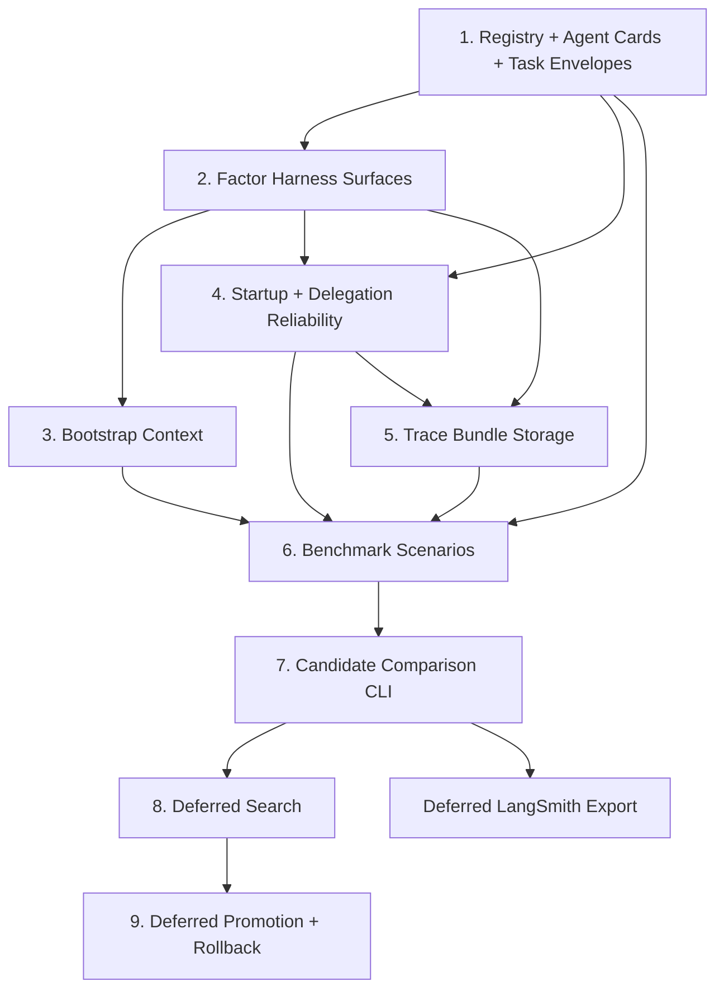

# Plan: Implement Meta-Harness Optimization for btrain

**Status**: Draft
**Version**: 0.2.0
**Author**: btrain
**Date**: 2026-04-19

## Summary

This plan turns the Meta-Harness spec into an implementation sequence that keeps the first release narrow, local-first, and immediately useful inside `btrain`.

The plan follows one rule throughout: do not start with hosted observability or autonomous search. First make the local harness explicit, then improve startup/context and delivery reliability, then capture local traces, then build local evals and comparison, then consider follow-on work.

Primary input:

- [specs/009-meta-harness-for-btrain.md](/Users/bfaris96/btrain/specs/009-meta-harness-for-btrain.md)
- [research/a2a-langgraph-langsmith-evaluation.md](/Users/bfaris96/btrain/research/a2a-langgraph-langsmith-evaluation.md)

## Review Goals

Review this plan for:

- whether the useful-now local scope is sharp enough
- missing dependencies between bootstrap context, traces, and evals
- places where the plan leaks beyond harness code into unrelated repo code
- missing rollback points
- missing benchmark coverage for workflow-specific regressions
- any step that would make candidate comparison unfair or irreproducible
- whether LangSmith and other external integrations are deferred cleanly enough

## Repo-Local Grounding

This plan is grounded in the repo-local material currently present in this checkout:

- `README.md`
- `docs/architecture.md`
- `research/implementation_plan.md`
- `specs/008-agent-orchestration-foundations.md`

`AGENTS.md` references additional research documents that are not present in this checkout, so startup/bootstrap work should treat missing optional docs as a recoverable condition rather than a fatal assumption.

## Implementation Principles

- `btrain` stays authoritative for workflow state and lane lifecycle.
- Prefer repo-local capability cards, task/artifact envelopes, and file-backed traces before adding external protocol or SaaS integrations.
- Prefer a canonical local harness registry, authoring guide, and inspection surface before adding marketplace or packaging concepts.
- Harness changes must be versioned, attributable, and benchmarked.
- Compare candidates on end-to-end workflow outcomes before efficiency metrics.
- Store raw trace artifacts so failures can be diagnosed from evidence.
- Keep the mutation surface small until the benchmark proves it is worth broadening.
- Default harness behavior must remain readable and manually editable.
- Do not assume all valid work ends in a source diff.
- Do not assume workflow adoption is perfect; design nudges, acknowledgement, and recovery paths explicitly.
- LangSmith is optional follow-on observability, not the source of truth for the first implementation.

## First-Version Decisions

### Local-first immediate scope

The immediate milestone stops at repo-local capability structures, startup/bootstrap improvements, delivery acknowledgement, local traces, local evals, and local comparison.

### Search starts after comparison

The first milestone ends with traceable, benchmarkable, comparable harness profiles. Search is a follow-on milestone, not the entry point.

### Baseline before variation

The first step is to capture current inline behavior as an explicit `default` harness profile. Alternative profiles should be compared against that frozen baseline, not against moving inline code.

### Local capability and task structures first

The first version should define compact repo-local Agent Card and task/artifact envelope structures before any external protocol compatibility work.

### Registry and authoring contract first

The first version should also define a canonical local harness registry, authoring guide, and directory contract so harness work is discoverable and consistent instead of being encoded only in source spelunking.

### Bounded bootstrap

Bootstrap context will be compact, deterministic, and first-turn only by default.

### Startup/init path

The first version should include an explicit repo-startup command for a newly launched agent so users do not have to remember the whole `btrain` ritual manually.

### Hard gates plus exception paths

Scoring should use a small set of hard failures plus artifact-based exception paths for valid diffless work such as research and investigations.

### Delegation must acknowledge delivery

Delegation transport is not considered successful just because a command was issued; traces and benchmarks must capture actual wakeup delivery and acknowledgement.

### Local artifacts

Trace bundles and candidate metadata live under `.btrain/harness/` so the system remains local and auditable.

### LangSmith deferred

Hosted observability and eval backends are explicitly deferred. LangSmith may become a later exporter or mirror, but it is not part of the first implementation milestone.

### File-backed persistence only

The first version uses files only:

- per-run artifact directories
- append-only JSONL or JSON indexes
- candidate metadata files

No database is introduced in the initial implementation.

### Human promotion

Candidate selection may be automated, but activation of a new default harness remains a human decision.

## Planned CLI Surface

The immediate workstreams below assume a small, explicit CLI surface of this shape:

- `btrain harness list`
- `btrain harness inspect`
- `btrain startup`
- `btrain harness eval`
- `btrain harness compare`

If later follow-on work adds local search or profile promotion, then `btrain harness promote` and `btrain harness rollback` can be added as a second-stage CLI surface.

## Dependency Diagram



## Proposed Harness Artifact Layout

The first file-backed version should converge on a structure close to:

```text
.btrain/harness/
├── registry.json
├── profiles/
│   └── default/
├── schemas/
├── templates/
├── benchmarks/
├── candidates/
│   └── cand_<id>.json
├── index.jsonl
└── runs/
    └── <run-id>/
        ├── summary.json
        ├── prompts/
        ├── events/
        └── artifacts/
```

The exact filenames can change, but the separation between profiles, candidate metadata, run summaries, and raw artifacts should remain stable.

## Workstreams

### Workstream 1: Registry, local agent cards, and task/artifact envelope

**Goal**: add compact repo-local structures that improve routing, context hygiene, diffless evidence handling, and harness discoverability without adopting an external protocol.

**Primary changes**

- define a canonical local harness registry with profile metadata, supported commands, schema versions, and benchmark fixture references
- define a canonical harness authoring guide that explains how to add or modify profiles, schemas, startup packets, trace fields, and benchmark fixtures
- define a repo-local Agent Card schema for registered agent instances
- surface readiness, role, runner, repo, lane-affinity, and routing-relevant metadata through that schema
- define a compact task/artifact envelope for lane work, reviews, repairs, delegated wakeups, and diffless outputs
- make harness profiles self-describing enough for list and inspect commands
- prefer task/artifact references over replaying raw history where possible
- make the envelope usable by bootstrap, tracing, and benchmark flows

**Likely files**

- [README.md](/Users/bfaris96/btrain/README.md)
- [agentchattr/registry.py](/Users/bfaris96/btrain/agentchattr/registry.py)
- [agentchattr/router.py](/Users/bfaris96/btrain/agentchattr/router.py)
- [agentchattr/btrain/context.py](/Users/bfaris96/btrain/agentchattr/btrain/context.py)
- [src/brain_train/core.mjs](/Users/bfaris96/btrain/src/brain_train/core.mjs)
- [src/brain_train/harness/index.mjs](/Users/bfaris96/btrain/src/brain_train/harness/index.mjs)
- new repo-local schema or helper files under `.btrain/` or `src/brain_train/`

**Tests**

- registry parsing and fallback coverage
- list/inspect metadata coverage
- card schema parsing and fallback coverage
- routing metadata coverage
- task/artifact envelope serialization coverage
- compact artifact-reference rendering coverage
- authoring-guide path/discovery coverage if surfaced in CLI output

### Workstream 2: Factor explicit harness surfaces

**Goal**: move the important harness behavior behind explicit profile/config/template seams.

**Primary changes**

- define a harness profile schema
- capture current inline behavior as the `default` harness profile before adding variants
- ensure each profile carries self-describing metadata suitable for registry/list/inspect output
- extract or centralize loop-dispatch prompt construction
- extract lane-context and bootstrap formatting configuration
- extract startup/init prompt construction
- make review-run prompts and routing configuration profile-aware
- make delegation notification behavior profile-aware
- record active profile metadata on eval runs

**Likely files**

- [src/brain_train/core.mjs](/Users/bfaris96/btrain/src/brain_train/core.mjs)
- [src/brain_train/cli.mjs](/Users/bfaris96/btrain/src/brain_train/cli.mjs)
- [agentchattr/btrain/context.py](/Users/bfaris96/btrain/agentchattr/btrain/context.py)
- [agentchattr/wrapper.py](/Users/bfaris96/btrain/agentchattr/wrapper.py)
- new harness profile files under `.btrain/` or a repo-local template directory

**Tests**

- default profile parity coverage
- profile loading and fallback behavior
- self-describing profile metadata coverage
- active-profile metadata written to run output

### Workstream 3: Add compact bootstrap context

**Goal**: eliminate common first-turn exploration waste without hiding important lane state.

**Primary changes**

- generate a compact bootstrap block from repo and lane state
- include agent card and task/artifact references when they are cheaper than raw history
- inject the block on first dispatch when enabled by profile
- enforce truncation and redaction rules
- keep delegation packet summary integrated with bootstrap output
- include repo-specific “what to do first” guidance without dumping the full docs
- fall back cleanly when repo-declared docs are missing or stale, while surfacing the omission in the bootstrap output

**Likely files**

- [src/brain_train/core.mjs](/Users/bfaris96/btrain/src/brain_train/core.mjs)
- [agentchattr/btrain/context.py](/Users/bfaris96/btrain/agentchattr/btrain/context.py)
- [agentchattr/wrapper.py](/Users/bfaris96/btrain/agentchattr/wrapper.py)

**Tests**

- first-turn-only injection coverage
- bounded-size output coverage
- stable formatting for identical state
- redaction or omission coverage for noisy inputs

### Workstream 4: Startup and delegation reliability

**Goal**: make cold-start behavior and delegated wakeups reliable enough to benchmark and improve.

**Primary changes**

- add an explicit repo-startup command for newly launched agents
- add probe-first harness list and inspect commands so agents can orient before mutation or comparison
- add first-touch reminders when an agent responds without recent `btrain` context
- trace delegation delivery, acknowledgement, and retry behavior
- make delegation-trigger failures visible in summaries instead of silent

**Likely files**

- [src/brain_train/cli.mjs](/Users/bfaris96/btrain/src/brain_train/cli.mjs)
- [src/brain_train/core.mjs](/Users/bfaris96/btrain/src/brain_train/core.mjs)
- [agentchattr/wrapper.py](/Users/bfaris96/btrain/agentchattr/wrapper.py)
- [agentchattr/btrain/notifications.py](/Users/bfaris96/btrain/agentchattr/btrain/notifications.py)
- related agentchattr poller or trigger code if acknowledgement needs a transport change

**Tests**

- startup/init output coverage
- harness list and inspect coverage
- first-touch reminder coverage
- delegated wakeup acknowledgement coverage
- retry or surfaced-failure coverage when delivery fails

### Workstream 5: Add harness trace bundles

**Goal**: persist enough information to compare and diagnose harness runs.

**Primary changes**

- add a trace bundle directory under `.btrain/harness/`
- write run summaries plus raw artifacts
- capture agent card and task/artifact references alongside prompt/context inputs
- capture prompt/context inputs, review outputs, timing, and outcome labels
- define stable failure categories
- keep the persistence layer file-backed and rebuildable from artifacts
- record evidence references for diffless tasks and research outputs

**Likely files**

- [src/brain_train/core.mjs](/Users/bfaris96/btrain/src/brain_train/core.mjs)
- [src/brain_train/cli.mjs](/Users/bfaris96/btrain/src/brain_train/cli.mjs)
- [agentchattr/wrapper.py](/Users/bfaris96/btrain/agentchattr/wrapper.py)
- new helper modules for run metadata and artifact writing if the code split is justified

**Tests**

- trace bundle creation coverage
- raw-artifact path coverage
- summary index consistency coverage
- failure classification coverage

### Workstream 6: Build the harness benchmark

**Goal**: create a repeatable eval harness for `btrain` workflow quality.

**Primary changes**

- define benchmark scenarios and fixtures
- define benchmark fixture manifests so scenarios are discoverable without reading implementation internals
- support multiple harness profiles per eval run
- report per-scenario and aggregate results
- link each scored scenario back to a trace bundle
- score hard failures separately from primary outcomes and advisory metrics
- include artifact-based completion checks for diffless work

**Initial benchmark categories**

- writer path with correct lane discipline
- reviewer path on seeded defects
- changes-requested loop handling
- repair-needed recovery path
- delegation packet fidelity and lock discipline
- bootstrap-efficiency scenarios where redundant exploration should drop
- diffless research or investigation path with artifact-based evidence
- cold-start adoption path for a newly launched agent
- delegation-delivery reliability path

**Likely files**

- [src/brain_train/cli.mjs](/Users/bfaris96/btrain/src/brain_train/cli.mjs)
- new benchmark fixtures under `test/` or a dedicated eval directory
- existing `btrain` test helpers reused for deterministic setup

**Tests**

- scenario registration coverage
- benchmark fixture manifest parsing coverage
- aggregate score calculation coverage
- held-out-scenario selection coverage
- item-to-trace linking coverage
- diffless completion-proof coverage
- delegation acknowledgement scoring coverage

### Workstream 7: Add candidate comparison commands

**Goal**: make harness comparison usable before automated search exists.

**Primary changes**

- add CLI output for comparing profile runs
- surface deltas in hard-failure count, primary outcomes, and advisory metrics
- expose the best candidate and the evidence behind it

**Likely files**

- [src/brain_train/cli.mjs](/Users/bfaris96/btrain/src/brain_train/cli.mjs)
- trace-summary helpers under `src/brain_train/`

**Tests**

- aggregate comparison rendering
- candidate sorting and tie-breaking
- missing-artifact handling

### Workstream 8: Deferred follow-on search

**Goal**: add an outer loop that proposes new harness variants using prior evidence.

**Primary changes**

- define an allowlist of editable harness surfaces
- create candidate work directories and lineage metadata
- feed prior source, scores, and traces into the proposer
- benchmark new candidates automatically
- keep promotion separate from proposal and benchmarking
- avoid optimizing directly on live-repo observational metrics

**Likely files**

- new search orchestration module under `src/brain_train/`
- harness template/config files from workstream 2
- trace and comparison helpers from earlier workstreams

**Tests**

- allowlist enforcement
- candidate lineage recording
- candidate benchmark execution
- rejection of unscored or failed candidates

### Workstream 9: Deferred promotion, rollback, and docs

**Goal**: make winning harnesses safe to adopt and easy to revert.

**Primary changes**

- add explicit promotion and rollback actions
- record active default profile changes in metadata
- document the workflow for manual tuning, eval runs, candidate review, and promotion

**Likely files**

- [README.md](/Users/bfaris96/btrain/README.md)
- [src/brain_train/cli.mjs](/Users/bfaris96/btrain/src/brain_train/cli.mjs)
- harness profile metadata files

**Tests**

- promotion updates active profile cleanly
- rollback restores prior default profile
- active profile is visible in subsequent runs

### Deferred external follow-on: Optional LangSmith export

**Goal**: optionally mirror local trace/eval artifacts into LangSmith after the repo-local model already exists and proves useful.

**Primary changes**

- map local trace bundles and benchmark results into LangSmith-compatible upload/export shapes
- keep local files as the source of truth
- make export opt-in through config or environment variables
- avoid making the hosted backend a prerequisite for startup, tracing, or comparison

**Likely files**

- new export helper under `src/brain_train/`
- CLI wiring under [src/brain_train/cli.mjs](/Users/bfaris96/btrain/src/brain_train/cli.mjs)
- optional docs updates in [README.md](/Users/bfaris96/btrain/README.md)

**Tests**

- export payload generation coverage
- local-first fallback coverage when export is disabled or unavailable
- no-source-of-truth regression coverage

## Rollout Sequence

### Slice 1

- workstreams 1, 2, and 3
- outcome: local capability/task structures plus explicit harness surfaces and compact bootstrap context

### Slice 2

- workstreams 4 and 5
- outcome: reliable startup/delegation behavior plus trace bundles

### Slice 3

- workstreams 6 and 7
- outcome: benchmarkable eval loop plus candidate comparison

### Slice 4

- deferred workstreams 8 and 9
- outcome: constrained search and human-gated promotion

### Slice 5

- deferred external follow-on
- outcome: optional LangSmith export or mirroring without changing the local source of truth

## Risks and Controls

### Risk: Bootstrap becomes noisy

Control:

- strict byte and line limits
- deterministic truncation
- benchmark efficiency and success together

### Risk: Trace bundles bloat quickly

Control:

- compact summary index plus raw artifacts stored separately
- retention rules in later follow-up work

### Risk: Baseline drift makes candidate comparison unfair

Control:

- freeze current behavior into a `default` profile before experimentation
- compare new candidates against that baseline rather than live inline code
- keep baseline traces and summaries reviewable

### Risk: Search optimizes for the benchmark only

Control:

- held-out scenarios
- per-scenario inspection
- human-gated promotion

### Risk: Valid research work is mis-scored because it has no diff

Control:

- artifact-based completion proofs
- explicit diffless benchmark scenarios
- do not use “has diff” as a universal success proxy

### Risk: Agents or users skip `btrain`

Control:

- explicit startup/init command
- first-touch reminders
- trace and benchmark adoption failures directly

### Risk: Repo-doc discovery is brittle

Control:

- treat missing optional docs as a warning, not a crash
- fall back to repo-local README and architecture guidance
- include missing-source notes in startup/bootstrap artifacts

### Risk: Delegation is issued but not actually delivered

Control:

- acknowledgement requirement
- retry or surfaced-failure behavior
- benchmark delegation transport explicitly

### Risk: Candidate mutation scope drifts

Control:

- explicit allowlist
- lineage metadata
- hard rejection for edits outside approved surfaces

### Risk: Harness structure sprawls into hidden conventions

Control:

- canonical local registry
- canonical harness authoring guide
- list/inspect commands that expose the active structure directly
- stable homes for profiles, schemas, templates, and benchmark fixtures

### Risk: External observability or protocol work distorts the local core

Control:

- keep LangSmith export optional and delayed
- keep local files authoritative
- adopt A2A- or LangGraph-like ideas without introducing them as required runtime dependencies

## Exit Criteria

The first end-to-end milestone is complete when:

- `btrain` can surface compact repo-local Agent Cards and task/artifact envelopes where they improve routing or context loading
- `btrain` has a canonical local harness registry plus probe-first list/inspect commands
- `btrain` can run at least two named harness profiles
- first-turn bootstrap context is profile-controlled and bounded
- a newly launched agent can run a dedicated startup/init command to orient itself in the repo
- eval runs emit trace bundles with stable metadata
- benchmark output compares profiles on hard failures, workflow outcomes, and advisory efficiency metrics
- no hosted backend is required for startup, tracing, evals, or comparison
