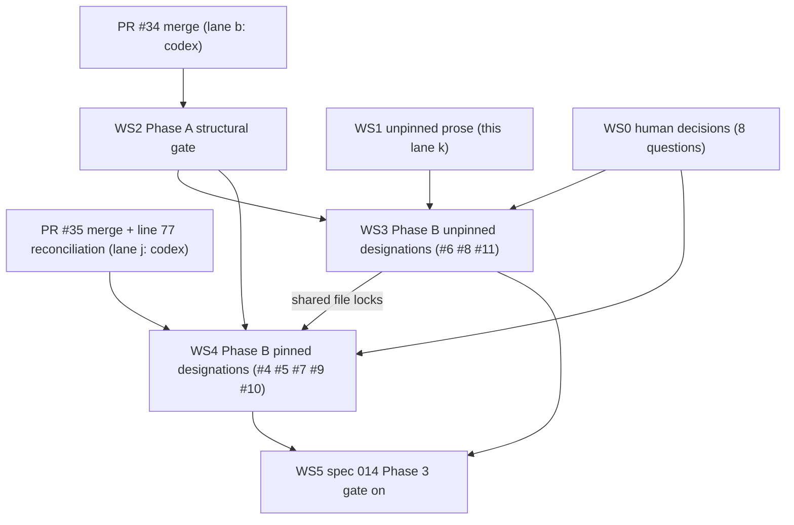

# Plan: Implement the Lane Transition Contract (spec 015)

**Status**: Draft
**Version**: 0.1.2
**Author**: btrain
**Date**: 2026-09-01
**Updated**: 2026-09-08 (v0.1.2: WS3 advisory stage delivered, enforcement step pending; v0.1.1: WS0 decisions recorded in spec 015 v0.1.4)

## Summary

This plan turns spec 015 into an ordered sequence of lanes. It interleaves
with spec 014 rather than following it: spec 014 Phase 3 cannot switch on
until the harness candidate tally is zero, and spec 015 is how each candidate
reaches a designation. The plan therefore does not "finish 014 first". It
merges the two open 014 PRs, ships the behavior-preserving half of 015, and
then retires ledger findings one designation at a time until the 014 gate can
close.

One rule holds throughout: prose lands before model, model before code, and no
row in the production list is enforced until its owning prose exists.

Primary input:

- [specs/015-lane-transition-contract.md](015-lane-transition-contract.md)
- [specs/014-specula-formal-verification-pilot.md](014-specula-formal-verification-pilot.md)
- [specs/checklists/015-transition-contract.md](checklists/015-transition-contract.md)
- [test/formal/README.md](../test/formal/README.md)

## Review Goals

Review this plan for:

- whether any workstream edits a section pinned by `LaneLock.tla` before PR #35 merges
- whether the structural half (WS2) can regress observable CLI behavior
- whether every semantic step cites the prose that lands first
- missing rollback points
- whether lane locks in this repository make a step unclaimable when scheduled
- whether the human decisions are isolated so they do not block unrelated steps

## Repo-Local Grounding

Verified on 2026-09-01 against this checkout:

- `npm test`: 559 passing, 9 skipped (after PR #34).
- `npm run test:formal`: exits 1. The candidate gate fails as designed
  (`resolve-from-idle`, `update-actor-unchecked`, `update-source-status`
  tallied). The implementation-mode test also fails because the mirror in
  `test/formal/lane-lock-model.mjs:377-386` predates PR #33; that failure is
  stale, not a regression.
- `LaneLock.tla` pin hash on PR #35 equals the hash of the current `main`
  prose (`90cb7554…613ed`), so #35 is mergeable against `main` as long as no
  pinned section changes first.
- Lane locks: lane `b` (PR #34, codex) holds `src/brain_train/` and `test/`;
  lane `j` (PR #35, codex) holds `scripts/tla_pin.py` and `specs/tla/`; lane
  `e` (claude) holds `README.md` and `docs/`.
- Lane and lock state is local (`.claude/collab/HANDOFF_*.md` and
  `.btrain/locks.json` are untracked), so branch switches do not move it.

## Implementation Principles

- btrain stays the workflow authority; no graph runtime is added.
- Zero runtime dependencies. `fast-check` stays a dev dependency.
- The production list, `LaneLock.tla`, and `lane-lock-model.mjs` are three
  hand-authored transcriptions of prose. None is generated from another.
- Legacy rows preserve current behavior until prose retires them.
- Every step that touches a modeled entry point carries a spec 014
  formal-impact declaration.
- Pinned sections are edited only inside the lane that also repins
  `LaneLock.tla`, so the pin never goes stale on `main`.
- Advisory before enforcement for every behavior change agents rely on today.

## First-Version Decisions

### Interleave 014 and 015

Spec 014 Phase 3 depends on the designations spec 015 packages. Waiting for
014 to "finish" would wait on 015. The order below alternates between them.

### Merge the open 014 PRs before any code lane

PR #34 holds the source and test locks. PR #35 holds the model and pin script.
WS2 and WS3 cannot be claimed until #34 merges, and WS4 cannot edit pinned
prose until #35 merges.

### Prose that is unpinned ships first

Spec 005 FR-7, a new spec 006 FR-29, and the stale drift notes in spec 002
outside its pinned sections do not touch the pin. They land in WS1, in
parallel with the open PRs.

### The structural half ships as one lane

`transitions.mjs`, the gate, the watchdog rerouting, the `ENOENT` fix, the
cross-check test, and the exporter are one reviewable change with an
all-or-nothing rollback.

### Human decisions are batched

The eight open questions in spec 015 are collected into one decision request
(WS0) so WS4 is not blocked question by question.

## Dependency Diagram

## Workstreams

### Workstream 0: Human decisions

**Goal**: answer the eight open questions in spec 015 so WS4 has designated
rules to encode.

**Primary changes**

- one decision record, either as answers appended to spec 015 Open questions
  or as a short decision section in spec 002 once it reopens
- questions 1 (PR-feedback shortcut), 2 (doctor as guardian for resync), 3
  (override exit from repair), 4 (FR-18 budget across re-claims), 5 (who may
  abandon an in-progress lane), 6 (unverified actor policy), 7 (who may declare
  `repair-needed` manually), 8 (owner reassignment)

**Owner**: a human. No agent may decide these.

**Blocked by**: nothing. Can start today.

**Status**: done. Brian Faris answered all eight on 2026-09-08; the decision
record is spec 015 v0.1.4, section `Decisions (2026-09-08)`. WS4 and Phase B
step 4 are no longer blocked on this workstream.

### Workstream 1: Unpinned prose (this lane)

**Goal**: land every prose change that does not touch a pinned section.

**Primary changes**

- spec 015 v0.1.1 and its requirements checklist
- this plan
- spec 005 FR-7: only the lane owner may move a lane to `needs-review`;
  btrain rejects other actors rather than reassigning the reviewer (finding 6)
- spec 006 FR-29 `repair-needed` transitions: entry from active statuses
  only; exits to `in-progress` by the repair actor or to `resolved` after
  FR-18 escalation or through the FR-2c/2d override; no other exit
  (finding 11). Adopts the spec 014 provisional designation with the override
  exit added
- spec 002 lines 9, 87, 91: describe the three PR #33 repairs as repaired.
  These lines are outside every pinned section

**Likely files**

- [specs/015-lane-transition-contract.md](015-lane-transition-contract.md)
- [specs/016-lane-transition-contract-implementation-plan.md](016-lane-transition-contract-implementation-plan.md)
- [specs/checklists/015-transition-contract.md](checklists/015-transition-contract.md)
- [specs/002-multi-lane-handoffs.md](002-multi-lane-handoffs.md)
- [specs/005-review-findings-rework-loop.md](005-review-findings-rework-loop.md)
- [specs/006-workflow-resilience-and-guardian.md](006-workflow-resilience-and-guardian.md)

**Tests**

- the pin hash recomputed with the PR #35 `tla_pin.py` algorithm over the
  current pinned sections equals the recorded hash after the edits
- `btrain review code --lane k --base main` exits 0

**Formal impact**: none. Code-free; pin check only (spec 014 FR-7).

**Blocked by**: nothing.

### Workstream 2: Phase A structural gate

**Goal**: one gate, identical behavior.

**Primary changes**

- fix the stale implementation mirror in `lane-lock-model.mjs:377-386` so
  `npm run test:formal` fails only on the candidate gate
- reword ledger #9 (terminal half repaired in PR #33) and extend #5 (missing
  file reads repo state and fabricates history)
- add `src/brain_train/transitions.mjs` with rows 1-20, L1-L15, and the system row L16 from spec 015, plus the `primary` marker per status
  as data, `owner` and `state` included
- add `applyTransition` and route `claimHandoff`, `patchHandoff`,
  `requestChangesHandoff`, `resolveHandoff`, `applyPrStatusToHandoff`, the
  `pr create` status write (`pr-flow.mjs:937`), and `applyWatchdogRepairs`
  (`core.mjs:8717`) through it, inside the existing registry critical section
- replace the raw `ENOENT` at `core.mjs:5185` with a `BtrainError`
- fix `resolveHandoff`'s missing-file fallback at `core.mjs:5680-5685` so it
  never reads repo-level state for a lane
- keep `inferPeerReviewer` from replacing a valid reviewer (spec 015 FR-9)
- add the cross-check test with guard fixtures (spec 015 FR-7), legacy rows
  excluded
- add `btrain transitions --format json|mermaid`; make
  `defaultNextActionForStatus`, `buildLaneGuidance`, and
  `describeLoopAgentReason` read the list

**Likely files**

- [src/brain_train/core.mjs](../src/brain_train/core.mjs)
- [src/brain_train/pr-flow.mjs](../src/brain_train/pr-flow.mjs)
- [src/brain_train/cli.mjs](../src/brain_train/cli.mjs)
- new `src/brain_train/transitions.mjs`
- [test/formal/lane-lock-model.mjs](../test/formal/lane-lock-model.mjs)
- [test/formal/lane-lock-harness.test.mjs](../test/formal/lane-lock-harness.test.mjs)
- [test/formal/README.md](../test/formal/README.md)
- new `test/transitions.test.mjs`

**Tests**

- full suite unchanged before and after (559 passing at the time of writing)
- `npm run test:formal`: implementation mode passes; contract-mode candidate
  tally names the same labels as before the change
- cross-check test passes
- one regression test per fixed defect: `ENOENT`, missing-file resolve,
  reviewer inference
- `btrain transitions --format json` lists 36 rows (20 contract, 15 legacy, 1 system lock-release row)

**Formal impact**: no semantic impact, touches modeled entry points and the
harness. Pin check plus focused implementation validation plus focused harness
run before review (spec 014 FR-7).

**Rollback**: revert the merge commit. No new fields are written to handoff
files or `locks.json` in this phase.

**Blocked by**: nothing; PR #34 merged on 2026-09-01 and lane `b` released its locks.

### Workstream 3: Phase B unpinned designations

**Goal**: retire L3 (finding 6) and L7 (finding 11), and close finding 8.

**Primary changes**

- implement `btrain repair dispose --lane <id> --confirmed-by <human> --reason "..."`
  and the `repair-disposition` workflow event (spec 006 FR-29), with a
  harness fixture; without them the row 15 guard is unsatisfiable and every
  `repair-needed` exit funnels through the override
- model: add the disposition-or-override guard to `RepairResolve` in
  `LaneLock.tla` and `lane-lock-model.mjs` (spec 006 FR-29); repin
- advisory: row 2 actor guard and row 15 recorded-human-disposition-or-override guard (spec 006 FR-29) record
  `transition-advisory` and warn
- after the advisory window (spec 015 FR-5): enforce, remove L3 and L7
- ledger: mark 6, 8, 11 closed; harness candidate labels
  `update-actor-unchecked` (needs-review case) and
  `repair-resolve-before-escalation` become regressions
- WS0 Q6 (Option C): keep unconditional rejection of an unverified actor in
  enforcement mode; when exactly one agent is configured, the rejection
  message names it (`export BTRAIN_AGENT=<the-one-agent>`). Error-formatter
  change plus the spec 015 FR-6 text; no pin involved
- WS0 Q7 (Option C): any configured agent plus `system` may declare
  `repair-needed`; when the owner declares on their own lane, record a
  `self-repair-audit` field in the canonical lane-event log (one sentence in
  spec 006 FR-29, unpinned). The field is not a `transition-advisory` and is
  excluded from the FR-5 retirement gate. Row 13 moves from `provisional` to
  `designated`. Before L4 retires for repair entry, stage a
  `transition-advisory` for every repair-entry declaration L4 accepts today
  that row 13 will reject (unconfigured or unverified actor, invalid source
  status), and enforce only after the spec 015 FR-5 advisory minimum and
  quiescence windows pass. `self-repair-audit` is not that advisory and does
  not shorten the window

**Likely files**

- `src/brain_train/transitions.mjs`, `specs/tla/LaneLock.tla`,
  `test/formal/lane-lock-model.mjs`, `test/formal/README.md`,
  `test/core.test.mjs`

**Tests**

- `test/core.test.mjs:4972` is rewritten: `repair-needed -> needs-review` is
  rejected, `repair-needed -> in-progress -> needs-review` is the legal path
- TLC passes with the modified `RepairResolve`
- advisory events appear in the workflow log for one exercised legacy path
- Q7 `self-repair-audit`: positive check that an owner declaring
  `repair-needed` on their own lane emits the field in the lane-event log;
  negative checks that a reviewer or `system` declaration does not emit it;
  and a check that the field is not counted by the FR-5 advisory-retirement
  tally
- Q6 error message: with exactly one configured agent and no verified actor,
  enforcement rejects and the message names that agent; with two or more
  agents the generic `--actor` / `BTRAIN_AGENT` fix is shown

**Formal impact**: semantic. Prose (WS1) first, model, then code.

**Blocked by**: nothing as of 2026-09-08. WS1 (#37), WS2 (#42), and PR #35
are merged and lane `j` released `specs/tla/`.

**Status (2026-09-08)**: advisory stage delivered in lane `c`. Landed:
`btrain repair dispose` and the `repair-disposition` event; the
`repair-resolve` override action consumed by `handoff resolve`; the FR-29
disposition-or-override guard in `LaneLock.tla` (`decision` variable,
`RepairDispose` and `RepairOverrideGrant` records, `RepairResolveNeedsDecision`
property, `DecisionOnlyDuringRepair` and `DispositionAfterEscalation`
invariants, FR-29 pinned) and in the harness mirror (`dispose` op); rows 2,
13, 15 designated; L3 and L7 in advisory with `transition-advisory` records
and warnings; the L4 repair-entry and repair-exit cases in advisory;
`self-repair-audit` on owner self-declarations (Q7); the Q6 fix text; the
spec 015 FR-9 `inferPeerReviewer` fix (finding 6); finding 8 closed with a
regression test. Remaining for the enforcement step, no earlier than 14 days
after this merge and with no L3/L7/L4-repair advisory event in the last 7
days: reject on L3, L7, and the L4 repair cases; remove L3 and L7; flip the
harness labels `update-actor-unchecked` (needs-review case) and
`repair-resolve-before-escalation` to regressions; rewrite the
`repair-needed -> needs-review` test from advisory to rejection.

### Workstream 4: Phase B pinned designations

**Goal**: retire L1, L2, L4, L5, L6 (findings 4, 5, 7, 9, 10).

**Primary changes**

- spec 002 `CLI Commands`: resolve requires an active lane; resolve from a
  PR-flow status is rejected; who may abandon an `in-progress` lane (WS0 Q5)
- spec 002 `PR-flow states and actors`: source statuses per row; row 12
  decision (WS0 Q1); `ready-to-merge -> pr-review` decision; line 77
  reconciliation if PR #35 did not already do it
- spec 014 `Normative-source prerequisite`: point repair exits at spec 006
  FR-29; split rescope from resync (WS0 Q2)
- spec 005 `Proposed Status Model`: no change expected; confirm
- spec 006 FR-18 (pinned): WS0 Q4 clarification that a fresh claim resets the
  repair count and `RepairClear` does not; scope the implementation count to
  events after the most recent claim without deleting history; update the
  `test/formal/README.md` Known gaps entry
- spec 006 FR-2 designation text and the spec 014 rescope/resync split (WS0
  Q2, Option B): doctor resyncs only in `in-progress`, `changes-requested`,
  `repair-needed`; owner only elsewhere; decide whether `Resync` is a system
  action in the model or an abstract external event
- repin `LaneLock.tla`; add `ReturnToPr` (Q1) and `Reassign` (Q8); add
  `Resync` if WS4 models doctor resync as a system action; TLC
- production rows 6, 12, 17, 20 move from `undesignated` to `designated`
  or are removed
- advisory then enforce; remove L1, L2, L4, L5, L6, L8, L9
- spec 015 Phase B step 4 in the same lane: one-line designations for L10
  (spec 005 FR-5, pinned; WS0 Q8 Option C with swap policy A-i, row 20 split
  into `--owner` and `--reviewer` sub-rows, `authorHistory` and
  `AuthorSeparation` in the model), L11-L15 (spec 002 CLI Commands); then
  advisory, then enforce; remove them
- rewrite `test/core.test.mjs:1495-1503`, `test/core.test.mjs:1539`,
  `test/watchdog.test.mjs:122` to the designated paths

**Likely files**

- `specs/002-multi-lane-handoffs.md`, `specs/014-specula-formal-verification-pilot.md`,
  `specs/tla/LaneLock.tla`, `specs/tla/.tlc-results/LaneLock.json`,
  `src/brain_train/transitions.mjs`, `test/formal/*`, `test/core.test.mjs`,
  `test/watchdog.test.mjs`

**Tests**

- TLC passes on the widened model; the mutation check in
  `specs/tla/README.md` still reports a violation when a guard is removed
- candidate tally reaches zero; the `candidate findings absent` gate test
  passes and is then retired
- Q4 reclaim regression against the real CLI and event log: a lane enters
  `repair-needed`, is cleared, resolves, is reclaimed, and enters
  `repair-needed` for the same reason; the new task starts at attempt one and
  the earlier repair events remain in the log. The FR-6 harness does not
  compare attempt-counting internals (`test/formal/README.md` Known gaps), so
  this is a production-level test, not a harness fixture
- Q8 provenance against the real CLI and event storage: a direct
  owner/reviewer swap is rejected; a sequence of individually valid
  reassignments that would make a prior owner or author the reviewer is
  rejected; `authorHistory` survives across the sequence. The formal command
  generator (`test/formal/lane-lock-harness.test.mjs`) does not emit
  reassignments, so these must be production-level tests

**Formal impact**: semantic. Independent model-family review required (spec
014 FR-9).

**Blocked by**: WS3 merged. PR #35 and WS2 (#42) are merged and WS0 is
answered (spec 015 v0.1.4), but WS3 and WS4 both edit
`src/brain_train/transitions.mjs`, `specs/tla/LaneLock.tla`, `test/formal/*`,
and `test/core.test.mjs`, so under lane file locks only one can hold them at a
time. WS3 goes first because it is smaller and repins nothing beyond
`RepairResolve`.

### Workstream 5: Spec 014 Phase 3

**Goal**: block stale pins, counterexamples, and validation mismatches for the
pilot model in CI.

**Primary changes**

- flip the advisory CI job to blocking for `LaneLock.tla`
- adopt the exhaustion and tool-unavailable policy spec 014 requires

**Blocked by**: WS3 and WS4 (zero candidate tally).

## Sequencing

| Step | Work | Owner | Blocked by | Status (updated 2026-09-08) |
| --- | --- | --- | --- | --- |
| 1 | WS0 decisions | human | none | decided 2026-09-08 (spec 015 v0.1.4) |
| 2 | WS1 unpinned prose | claude, lane `k` | none | merged 2026-09-01 (#37) |
| 3 | PR #34 feedback and merge | claude, lane `b` | none | merged 2026-09-01 |
| 4 | PR #35 feedback, line 77 reconciliation, merge | codex, lane `j` | codex bot feedback | merged 2026-09-01 (#35) |
| 5 | WS2 structural gate | any agent | none | merged 2026-09-02 (#42) |
| 6 | WS3 unpinned designations | any agent | steps 2, 4, 5 | advisory stage in review 2026-09-08 (lane c); enforcement step after the FR-5 window |
| 7 | WS4 pinned designations | any agent | steps 1, 4, 5, 6 | ready once the WS3 advisory PR merges (the WS3 enforcement step is a separate later lane and does not block WS4) |
| 8 | WS5 014 Phase 3 | any agent | steps 6, 7 | blocked |

As of 2026-09-08 steps 1 through 5 are complete. Step 6 is ready to claim.
Step 7 follows step 6 because both workstreams lock the same runtime, model,
and test files; they are serialized, not parallel. Step 8 waits on both.

## Rollback Points

- After step 2: revert the docs commit; nothing else depends on it yet.
- After step 5: revert the merge; no persisted data changed.
- After each enforcement in steps 6 and 7: flip the row back to advisory
  (one-line change) while the prose stays; the model is unaffected.

## Acceptance Criteria

- Every spec 015 row has a `state` other than `legacy` or `undesignated`, or
  an open question naming the human decision it waits on, or a Phase B step
  that designates it.
- `npm run test:formal` passes with the candidate gate retired.
- Spec 014 Phase 3 is on for `LaneLock.tla`.
- No step edited a pinned section outside the lane that repinned the model.
