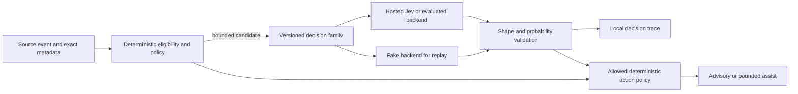

# 021 — Jev Decision Plane Implementation Plan

**Status:** Proposed, no runtime work authorized by this document
**Spec:** [021 — Jev Decision Plane](021-jev-decision-plane.md)
**Date:** 2026-09-24

## Plan decision

Build a small, shared evidence and evaluation layer, then pilot individual decision families in
separate lanes and PRs. Keep `btrain`'s state machine and review gates deterministic. The first
deliverable is a source-quality repair, because the [2026-09-24 corpus audit](../research/jev-btrain-experiment-results.md)
could not support the recommended PR benchmark. The handoff linter is the first new Jev-facing
feature, but starts as advisory. Other families remain distinct experiments with their own labels
and promotion decisions.

The repo has numbered flat specs and no `.specify/` script or template directory. This plan uses
that established format and records the design, data model, contracts, and quality gates here.

## Current integration points

| Surface | Existing state | Planned change |
| --- | --- | --- |
| `src/brain_train/handoff/pr-comments.mjs` | Captures deduplicated JSONL comment records, not event-time PR heads | Add prospective event snapshots and provenance without rewriting old rows |
| `src/brain_train/pr-flow.mjs` | Deterministic PR classifier plus off/shadow/feedback-only semantic seam | Preserve rules; add replayable traces and evaluate before activation |
| `src/brain_train/system-one.mjs` | Bounded hosted System One client with timeout and response checks | Wrap with versioned family policy and fake/local backend contract when needed |
| Handoff pre-flight in `core.mjs` | Checks required fields and placeholders | Add separate advisory semantic evidence lint after hard checks |
| Harness traces and events | Records workflow evidence | Link decision traces by source and version; do not create a second lane-state store |
| Spec 020 context budget | Measures and limits context | Supply a deterministic baseline for a later curation experiment |

The current `BTRAIN_JEV_MODE` defaults to `off`; that remains the default. Existing `assist` may
add high-confidence feedback but cannot manufacture clear approval. No phase enables it just by
landing code.

## Architecture and invariants

No model output directly mutates a lane, approval, lock, override, push, merge, or deployment.
The policy maps a *validated* answer to a family-specific list of permitted actions. A separately
approved feedback-only policy may treat a model finding as additional blocking evidence; it
cannot turn a model `clear` into approval. A candidate rejected before a call is `skipped`; an
attempted call with no valid answer is a `failure`. Only a valid answer without a permitted action
may `abstain`. In all three cases the existing deterministic result survives. The trace is
observational; the event log remains canonical.

### Proposed data model

| Entity | Required fields | Invariant |
| --- | --- | --- |
| `SourceSnapshot` | repository, PR/lane, event URL/ID/surface, author, event and capture times, reviewed commit, observed head or `unknown`, formal state, source hash | Never claim a retrospectively fetched head was observed at event time |
| `LabeledCase` | source reference, family, label, two annotators, adjudication, template/PR group, split, frozen manifest | Each group occurs in exactly one of train, calibration, or test |
| `DecisionFamily` | ID, question version, input schema, privacy class, allowed actions, timeout/call budget, fallback, thresholds | Version or threshold change creates a new comparable run |
| `DecisionAttempt` | family/source/input hashes, provider and model, question version, baseline, valid answers, probabilities, failure class, latency, applied action, later outcome | Failure has no prediction; trace omits raw private input and credentials |
| `PromotionRecord` | family ID, repository, pinned model ID, question version, benchmark ID, dataset hash, metrics, privacy approval, allowed action, threshold, approver, rollback trigger | Applies only to the recorded family, model pin, question version, and repository |

Source content may be read at its source for an authorized run. The shared trace stores only
source references, hashes, bounded metadata, and decision output. Access and retention follow
the source repository's policy. A hash is for integrity and correlation, not anonymization.

### Decision contract

The family gateway accepts `{family, questionVersion, sourceRefs, inputHash, privacyClass,
boundedState, questions, baseline}` and returns one of:

- `skipped`: deterministic eligibility or privacy policy prevents a call; record the reason and
  baseline, with no model prediction or attempted-call failure;
- `decision`: schema-valid typed answers with probability vectors, model pin, latency, and trace ID;
- `abstain`: schema-valid response without a sufficiently strong permitted action; record its
  valid answer and abstention reason, but apply no action;
- `failure`: timeout, authentication, rate limit, provider error, malformed or out-of-catalog
  answer, or absent response after an attempted call, with a reason code and no prediction.

An invalid answer shape is always `failure/invalid-answer`, never `abstain`; it increments the
response-shape failure count and reduces valid-prediction coverage. A valid `uncertain` class or
low-confidence choice can yield `abstain` from action, and stays in the valid-answer denominator.
Report skipped candidates outside the attempted-call denominator, and count failures separately
from valid-answer abstentions within that denominator.
The gateway applies limits before calling a provider, validates the full answer shape, and records
all outcomes. Each family owns a deterministic input builder and action policy. This is a proposed
internal contract; exact CLI syntax and file layout are chosen in each workstream PR. Versioned
fixtures must exercise the contract through a fake backend before a live backend is used.

## Workstreams and order

Each workstream is a separately reviewable implementation slice. The table names the first
artifact, not a promise to activate a model. Dependencies are explicit so an unready family can
remain off without blocking independent research.

| WS | First artifact | Depends on | Initial mode | Proceed criterion |
| --- | --- | --- | --- | --- |
| 0 Authority and data policy | Invariant tests, family registry, privacy and retention decision | Existing specs 002/005/006/014/015 | Off | No lane or PR gate can be crossed by fake model output |
| 1 PR evidence capture | Append-only snapshots and labeling manifest with source IDs and event-time head status | WS0 | No model | Historical unknowns excluded; capture/replay preserves exact provenance |
| 2 Decision trace and replay | Fake backend, versioned question sets, per-family metrics and failure ledger | WS0 | Offline | Same frozen manifest reproduces counts and metrics byte for byte |
| 3 PR signal evaluation | Existing seam replay plus expanded real labeled set | WS1–2 | Offline, then shadow if gated | Spec 021 PR offline gate passes before two-week live shadow |
| 4 Handoff evidence lint | Packet/diff/verification input builder and warnings | WS0, WS2 | Advisory | G4 before broad advisory use |
| 5 Verification and risk planning | Closed check catalog and additive suggestions | WS2 | Advisory | G5 before assist |
| 6 Repository-rule, end-of-turn, and review-risk checks | Rule-to-question registry and focused diff/turn scoring | WS2 | Advisory | G6 before broad advisory use |
| 7 Context curation and later transcript compaction selection | Shadow keep/full/reference decisions over bounded artifacts | WS2, Spec 020 metrics | Shadow | G7 before any omission or compaction |
| 8 Eligible routing and memory invalidation | Catalog-filtered rankings; versioned memory lease warnings | WS2, event/source provenance | Suggestion | G8 before assist |
| 9 Supervisor signals | Bounded observer trace and deterministic response policy | Durable supervisor prerequisites | Shadow | G9 before policy-triggered nudges |
| 10 Semantic history search | Read-only locally filtered shortlist and typed rerank | Source access policy, WS2 | Read-only | G10 before default-on search |
| 11 Provider comparison | Same frozen suites on pinned Jev and eligible alternatives | WS2 plus family datasets | Offline | Family-specific quality, calibration, cost, and failure comparison |

### Proposed family gates

These are *prospective acceptance targets*, not results from the pilot. Each benchmark is frozen
before question or threshold tuning; source groups stay in one split, two labelers adjudicate
disagreements, and synthetic/adversarial controls are reported separately. Only G4/G6 may
collect live labels through the pre-gate, opt-in advisory pilot; their output stays nonblocking.
The promotion owner may tighten these targets in a versioned record, never lower them after
seeing the test split.

| Gate | Minimum frozen evidence and comparator | Proceed threshold |
| --- | --- | --- |
| G4 Handoff lint | 100 real packets, at least 30 with reviewer-confirmed repair needs; current placeholder gate | Defect recall ≥90%, warning precision ≥80%, zero missed required negative-path controls in a separate control set; report reviewer minutes per packet |
| G5 Verification planner | 100 real changes, at least 30 with a missing check; current path/rule check catalog | Detect ≥10 percentage points more missing checks, suggestion precision ≥80%, zero mandatory checks removed or suppressed |
| G6 Rules and review risk | 100 focused diff or turn cases, at least 30 independently confirmed semantic violations and 10 severe findings; current deterministic rules and unprioritized review | Finding precision and violation recall each ≥80%, zero invented rule/source citations; risk ranking puts ≥90% of severe findings in the top 30% of the review queue; reviewer time no more than 10% above baseline at equal defect recall |
| G7 Context and compaction selection | 100 paired dispatches with outcome and token accounting; existing deterministic packet | Median context tokens ↓≥10%, zero pinned-item omissions, and task completion no more than 5 percentage points below baseline; a later transcript selector passes the same gate on a separate transcript set |
| G8 Routing and memory | 100 historical routing decisions plus 100 versioned memory claims with at least 30 superseded; current eligible routing and age-based memory baseline | Zero ineligible routes; routing success ≥5 percentage points above baseline; supersession precision and recall each ≥85% |
| G9 Supervisor signals | 100 labeled runner windows with at least 30 stuck/off-track; simple timer baseline | Stuck/off-track F1 ≥5 percentage points above timer baseline, false policy-triggered nudge rate ≤5%, zero direct lane-state mutations |
| G10 History search | 50 judged queries with source-access roles; lexical/structured shortlist alone | Recall@5 ≥10 percentage points above baseline, p95 response ≤2 seconds, zero unauthorized results |

The minimum counts are planning targets, not permission to pad a corpus with repeated templates.
If a gate cannot assemble independent cases, its family remains in research. G4 and G6 permit a
small opt-in advisory pilot before the threshold only to gather labels and reviewer-time evidence;
they do not authorize a blocking action. Any assist action also needs FR-10 privacy, safety,
failure, shadow, human approval, and rollback gates.

### WS0–2: evidence foundation

1. Extract the hard authority boundary into integration tests that inject `clear`, `feedback`,
   malformed, timeout, and contradictory fake answers at every family seam. The tests assert that
   only the explicitly allowed advisory/additive action is possible.
2. Extend future PR capture with an event-time head snapshot when btrain witnesses the event.
   Store `unknown` for backfills; do not retroactively label them current-head. Preserve the
   existing JSONL log and append new metadata or a linked evidence record. Record eventual PR/lane
   disposition separately from the original event.
3. Provide an annotation export that groups duplicates by PR and template, keeps raw text in the
   source repo, and requires independent labels and adjudication. Freeze a manifest before prompt
   or threshold tuning. Keep synthetic controls outside the real-history quota.
4. Build one metrics runner over the existing deterministic baseline and a fake decision provider.
   It reports wrong predictions and provider failures in separate denominators, including class
   support, confusion matrix, coverage, calibration, latency, and cost.
5. Add local traces with family/question versions, model pin, input hash, baseline, decision,
   action, and later outcome. Set a retention and access policy before live collection.

WS1 has no hosted calls and can start before the data-policy decision. WS2 can use synthetic or
approved public cases until the private-data policy is settled.

### WS3–4: first two measured seams

**PR signals.** Reuse `classifyPrReviewStateWithSemantic`; keep its deterministic candidate
selection and feedback-only assist policy. Reconcile candidate metadata with the new source
snapshot. Freeze 200 independently labeled, diverse, provenance-complete real cases with at
least 30 per class. Run exact existing baseline and pinned Jev on the same cases. Only if all
Spec 021 PR gates pass, run two weeks of shadow with no state change. A later assist proposal must
name its threshold, feedback-only action, false-feedback cost, and rollback trigger in a separate
promotion record. Never use semantic `clear` for approval.

**Handoff lint.** Ask narrow questions: does the packet match the changed surface, do verification
claims match supplied output, are known failures disclosed, and are review asks actionable? Use
the pilot's negative-path miss as a required control. Show warnings before handoff and to the
reviewer; do not block on a model score. Freeze real packets paired with reviewer feedback before
any automatic repair request. Compare against the current field/placeholder gate and report
warning precision, defect recall, and reviewer time. The generative peer reviewer diagnoses any
warning that needs code understanding.

### WS5–8: additive decisions

- **Verification planner:** deterministic rules first identify mandatory checks from paths and
  contracts. A model may add catalog checks. Test negative paths, cross-component wiring,
  migrations, security boundaries, and formal-impact cases. Out-of-catalog coverage produces
  abstention, never a forced check choice.
- **Rule and review-risk checks:** compile only explicit repository rules into versioned,
  inspectable questions. Scope to a focused diff or bounded end-of-turn record; route candidate
  findings to a reviewer. A risk score prioritizes review depth but cannot make a low-risk change
  skip required review. Evaluate diff and end-of-turn controls separately within G6.
- **Context curation:** shadow the selected content against Spec 020's measured baseline. Pin
  instructions, state, locks, unresolved findings, and recent failures by code. Start by choosing
  full/reference/omit for low-risk dispatch artifacts; retain source pointers and allow immediate
  fallback. Only after that passes, test transcript selection on its own frozen set. Jev chooses
  which records remain full or need separate summarization; it does not write a summary. Keep raw
  transcript records recoverable and apply G7 to the later selector independently.
- **Routing:** filter by authorization, availability, locks, role separation, and capability
  *before* ranking. Memory invalidation compares versioned claims to new events and emits an
  advisory stale marker; it never rewrites canonical history.

Promote one action at a time only after its own frozen data and operator approval. In particular,
no family can inherit the PR pilot's threshold or evidence.

### WS9–11: high-risk or optional expansion

The semantic observer waits for a durable, lane-aware supervisor with event cursor, retry,
acknowledgement, and restart recovery. It reads bounded evidence, emits progress/stuck/off-track
signals, and a deterministic policy may only choose an already allowed nudge or escalation after
hysteresis. It never mutates state directly. Semantic history search is a read-only command over
locally authorized and prefiltered records; no network decision belongs in the hot path of
ordinary status reads. Provider comparison uses frozen family suites; do not assume a small local
model is equivalent to Jev or that one backend wins all families.

### Product-owned companion work

The btrain gateway must not become a shared pool of ai_sales or mech_ai customer data. If those
teams pursue Jev, ai_sales should start from its existing scoring evaluation and then test
retrieval reranking and versioned coaching rubrics; mech_ai should test evidence sufficiency,
citation entailment, passage safety, ingest metadata, and query class on its existing golden
retrieval set. Each product owns its privacy, tenant/equipment eligibility, labels, baselines,
cost budget, and promotion record. Share only contract patterns and evaluation tooling where
useful, with no cross-repository corpus transfer implied.

## Evaluation and promotion matrix

| Stage | Required evidence | Allowed effect | Stop or rollback condition |
| --- | --- | --- | --- |
| Data collection | Source provenance, privacy class, independent label plan | None | Treating an unknown event-time head as current, or unauthorized text transfer |
| Opt-in advisory pilot, G4/G6 only | Source-specific privacy approval, hard-boundary tests, trace policy, operator/cohort opt-in, human review of every warning | Nonblocking warning to opted-in humans for label gathering | Any state change, unreviewed warning, privacy breach, or missing trace |
| Offline | Frozen cases, deterministic baseline, negative controls, pinned versions | None | Family gate fails, leakage between splits, or unclassified provider errors |
| Shadow | Offline gate passed, privacy approval, local traces, explicit duration | Trace and display only | Any privacy breach, missing trace, or unexplained provider failure trend |
| Advisory | Human-readable warning with source and uncertainty | Human may act | Warnings are misleading or reviewer load exceeds measured benefit |
| Assist | Signed family promotion record and rollback path | Only listed additive/reversible action | Harmful error, eligibility violation, missed mandatory check, or policy drift |

For unmeasured families, WS2 preregisters a minimum dataset, class support, error cost, and target
before the test split is examined. Comparisons include option-order changes, equivalent wording,
stale evidence, irrelevant text, no-valid-option cases, and injected failures. Report confidence
calibration only where the label volume supports it. A nominal confidence value is not a reason
to shorten the evaluation.

## Quality and formal gates

- Run focused component and composition tests for each new seam. Assert fallback preserves the
  exact previous state on timeout, malformed answer, missing key, or policy denial.
- For any change touching an existing modeled transition, follow Spec 014 and the owning spec:
  declare semantic impact, update pinned prose/model first where required, then run focused TLC
  and trace validation. This plan itself adds no lane transition.
- Check that source grouping prevents the same PR/template from appearing across calibration and
  test. Publish excluded-row counts and reasons.
- Make privacy, authorization, and source-repository boundaries explicit before any live hosted
  request. Never log credentials or copy ai_sales comment bodies into btrain.
- Keep the optional decision plane off by default and test a one-command family disable path.

## Risks and tradeoffs

| Risk | Design response |
| --- | --- |
| Small pilot looks like production proof | Label it exploratory; require a new frozen real-history benchmark |
| Backfilled comments appear current | Record event-time head or `unknown`; exclude unknown from exact-head labels |
| Model confidence is wrong | Measure harmful errors and calibration; abstain and keep deterministic fallback |
| Hosted data transfer exceeds policy | Per-family privacy class and explicit approval before private requests |
| Too many calls or long waits | Family budgets and bounded inputs; classify attempted-call failure and take no action |
| Advisory noise slows reviewers | Measure warning precision and time saved; switch off per family |
| Semantic observation steers workflow | Separate signal from deterministic action policy; stage behind durable supervisor |
| Local backend is mistaken for Jev | Same frozen suite and family-specific promotion; Kev-0.6B remains excluded |

## Context receipt

**Tier:** deep — this is a cross-subsystem spec and architecture plan.
**Questions:** Which Jev seams were previously proposed, which were actually measured, and which
workflow and data boundaries must remain authoritative?
**Primary sources:** [Jev opportunity assessment](../research/jev-typesafe-repo-assessment.md),
[pilot and corpus audit](../research/jev-btrain-experiment-results.md),
[Spec 002](002-multi-lane-handoffs.md), [Spec 014](014-specula-formal-verification-pilot.md),
[Spec 020](020-token-spend-and-decomposition.md), and current `pr-flow.mjs` / `system-one.mjs`.
The repo-local Unblocked deep search also returned ai_sales tenant and data-isolation decisions;
those are adjacent product constraints, not btrain authorization for cross-repo data use.
**Constraints:** exact workflow authority, reviewer independence, source privacy, and separate
failure/quality accounting.
**Gaps:** no independent real PR labels, no contemporaneous historical head snapshots, no Jev
evaluation for the eight unmeasured families, and no approved private-text hosted data policy.
**Durable writeback:** this spec and plan.
